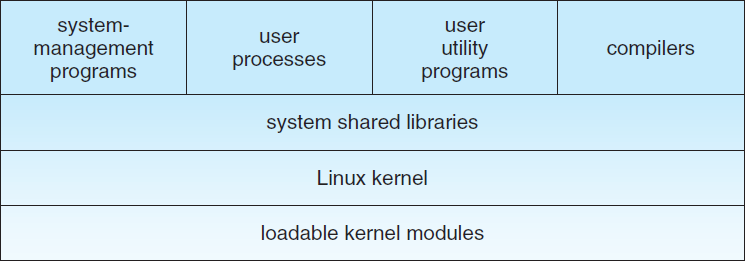

## Linux 系统

本章会深入讨论Linux操作系统。通过研究一个完整的，真实的系统可以看到我们所讨论的概念如何相互联系并与实践相联系。

Linux是一个UNIX变种，并在过去的几十年间流行起来，从一个房间大小的超级计算机变为与移动手机大小的电源设备。本章中，我们会看到Linux的历史和开发，涵盖Linux的用户和编程接口(很大程度上归功于UNIX传统的接口)。我们也会讨论这些接口的设计和实现。Linux是一个快速演化的操作系统。本章会讨论到内核4.12的版本(2017年发布)演进。

### 20.1 Linux History

Linux看起来就跟其他UNIX系统一样，确实，UNIX兼容性作为了Linux下面的主要设计目标之一。然而，Linux比大多数UNIX系统都要年轻。它的开发始于1991年，一个芬兰大学的学生，Linus Torvalds使用80386处理器(因特尔第一个真正的PC兼容的32位处理器)开发了一个小型的自包含内核系统，

在Linux的早期开发中，Linux的源码在因特网上是free的，免费且分配的限制最小。最终，Linux的历史即全世界所有开发者合作的结果，且几乎只通过因特网进行合作。从一个只实现了UNIX系统服务的一部分内核开始，Linux系统已经成长为包含所有期望功能的现代UNIX系统。

在早期时，Linux的开发大部分围绕中央操作系统内核，管理所有系统资源并直接与计算机硬件交互的核心特权功能。当然，我们需要更多的内核功能来使之成为一个完整的操作系统。因此，我们需要区分Linux内核和完整Linux系统之间的区别。Linux内核是由Linux社区负责开发的原始软件。Linux系统包含多个组件，有些组件是从头开发的，有些是从其他开发项目引入的，还有一些是与其他项目组联合开发的。

基本的Linux系统是一个标准的应用环境和用户程序环境，但它不会强制使用任何标准方法来管理所有可用的功能。随着Linux的成熟，在Linux系统之上还需要另一层功能。Linux发行版满足了这种需求。Linux发行版包含所有标准Libux系统的组件，以及一系列简化处理安装和Linux后续升级，管理系统上其他软件包的安装和删除的管理工具。一个现代发行版通常也包含管理文件系统，创建和管理用户账户，网络管理，web浏览器，文字处理器等的工具。

#### 20.1.1 The Linux Kernel

第一个对公众发行的Linux内核版本号为0.01，发行于1991年5月14日。它不包含网络，仅运行在80386兼容的因特尔处理器和PC硬件上，并严格限制了支持的设备驱动。虚拟内存子系统也相当基础，且不支持内存映射文件。然而，即使这样，它仍然支持写时读的共享页和地址空间的防护。由于第一个Linux内核是在Minix平台上开发的，因此唯一支持的文件系统为Minix文件系统。

下一个里程碑为发行为1994年3月14日的Linux 1.0。这个发行版结束了Linux内核三年的快速开发。最大的新特性可能就是网络了：1.0包含了支持UNIX标准TCP/IP的网络协议，以及兼容BSD网络开发的套接字接口。设备驱动也支持在以太网或(PPP或SLIP协议)串口线路或调至调节器上运行IP。

1.0内核也包含了一个新的，增强的文件系统，并不仅仅限于Minix文件系统，并支持了大量SCSI控制器，用于磁盘的高速访问。开发者扩展了虚拟内存子系统来支持使用分页交换文件以及使用内存映射任意文件(但1.0仅实现了只读的内存映射)。

该发行版中也支持了其他硬件。虽然限制了因特尔PC平台，但支持的硬件扩展到软盘和CD-ROM设备，和声卡，各种鼠标和国际键盘。内核为没有80387数学协处理器的80386用户提供了浮点仿真。实现的System V UNIX类型的进程间通信，包括共享内存，信号量以及消息队列。

至此，开始了1.1内核的开发，但在1.0之后修复了大量缺陷，并采用了一种模式作为Linux内核的标准编号约定。小版本号为奇数的内核，如1.1或2.5，为开发的内核。小版本号为偶数的内核为稳定的生产内核。对稳定内核的更新仅限于补丁版本，即开发版本可能会包含新的和相对未测试的功能。正如我们会看到的，这种模式持续到了版本3。

1995年3月发布了1.2版本的内核。该发行版几乎没有提供与1.0版本相同功能上的改进，但支持了更多类型的硬件，包括新的PCI硬件总线结构。开发者添加了另外一个PC特性，即通过80386 CPU的虚拟8086模式来允许为PC计算机仿真DOS操作系统。并通过更新IP实现支持了账户和防火墙。同时也支持内核模块的动态加载和卸载。

1.2版本的内核是最后一个仅支持PC的Linux内核。Linux 1.2发布的源代码包含对SPARC，Alpha和MIPS CPU的实施支持。但是到稳定的1.2内核发布后，才开始完全集成到其他体系结构中。

Linux 1.2发行版主要聚焦支持大量的硬件，以及现有功能的完整实现。此时很多新的功能正处于开发中，但直到1.2稳定版发行之后才将新代码何如到主内核源码中。1.3开发版中将大量的新功能添加到了内核中。

1996年6月发行的Linux 2.0版本发布了这些功能。由于添加了两个主要的新功能，因此增加了主版本号：支持多架构，包括64位的本地Alpha端口，和对称多处理（SMP）支持。此外，后续提升了内存管理代码来为文件系统数据提供了与块设备的缓存无关的统一缓存。由于这种改变，内核大大提升了文件系统和虚拟内存的性能。首次将文件系统缓存扩展到网络文件系统，并支持可写入的文件映射域。其他主要的提升包括增加内部内核线程，公开可加载的模块之间依赖关系的机制，支持按需自动加载模块，文件系统系统配合，和兼容POSIX的实时进程调度类。

1999年继续发布了Linux 2.2。增加了UltraSPARC系统端口。使用更加灵活的防火墙增强了网络，提升了路由和流量管理，支持TCP大窗口和选择确认。可以读取Acorn, Apple和NT磁盘，并使用内核模块的NFS守护进程增强了NFS。为了提高对称多处理器（SMP）的性能，将信号处理，中断和某些I / O被锁定在比以前更高的级别。

2.4和2.6版本的内核支持了SMP系统，日志文件系统，增强了内存管理和块I/O系统。2.6版本修改了线程调度，提供一个高效的O(1)调度算法。此外，2.6内核提供抢占，允许线程在内核模块运行时被抢占。

2011年7月发布了Linux内核3.0。主版本号从2增加到3来纪念Linux二十周年。新特性包括提升虚拟化支持，新的分页写回，提升了内存管理系统，也其他线程调度(完全公平调度，CFS)。

2015年4月发布了Linux内核4.0。这次对主版本的颠簸完全是任意的。Linux内核开发者越来越厌倦了不断增加的小版本号。今天的Linux内核版本除了发行顺序外，不代表其他任何内容。4.0的内核提供支持新的架构，提升了移动功能和很多迭代的改进。本章的剩余内存会聚焦新的内核。

#### 20.1.2 The Linux System

正如之前提到的，Linux内核构成了Linux项目的核心，但其他组件构成了一个完整的Linux操作系统。Linux内核是完全由专门为Linux项目而从头编写的代码组成，很多构成Linux系统的支持软件并不是Linux独有的，而是很多类UNIX操作系统所共有的。特别地，Linux使用了很多Berkeley’s BSD操作系统，MIT’s X Window System和Free
Software Foundation’s GNU项目上开发的工具。

这种工具共享在两个方向上都起了作用，Linux的系统库由GNU项目发起，但Linux社区通过解决遗漏、低效和漏洞大大提升了库。其他组件，如GNC C编译器(gcc)，是Linux已经使用的高质量组件。Linux下的网络管理工具由第一个开发的BSD代码演化而来，但最新的BSD衍生品，如FreeBSD则从Linux上借鉴了代码。例如，因特尔浮点仿真数学库和PC声卡设备驱动。

Linux系统由通过松散网络进行写作的开发者进行维护，由负责维护特定组件完整性的小组或个人组成。使用一些对公的FTP存档站点作为这些组件的标准存储库。文件系统层次结构标准文档也会由Linux社区进行维护，作为保证兼容多个系统组件的一种方式。该表中指定了标准Linux文件系统的布局，确定应在哪个目录名称下存储配置文件，库，系统二进制文件和运行时数据文件。

#### 20.1.3 Linux Distributions

理论上，任何人都可以都可以从ftp站点上获取并编译最新版本的系统组件，这就是早期Linux不得不执行的动作。随着Linux的成熟，很多个体和组织尝试通过提供标准的，预编译的包来降低这些难度。

这些集合或发布不仅仅涵盖基础的Linux系统，通常也包含额外的系统安装和管理单元，以及预编译和可以直接安装的很多常用UNIX工具软件包，如新的服务，web浏览器，文本处理和编辑工具，甚至游戏。

第一个发行版通过提供将所有文件解压到一个适当的位置来管理这些包。然而，现代发布版本中的主要特点之一是先进的包管理。现在的Linux发布包含了允许安装，升级或移除包的包跟踪数据库。

SLS发行版可以追溯到早期的Linux，是第一个可以被识别为完整发行版的Linux软件包集合。尽管SLS可以作为一个独立的实体进行安装，但它缺少现代Linux发行版所期望的包管理工具。Slackware发行版的出现极大提升了整体质量，但它的包管理仍比较弱。实际上，该方式仍然是Linux社区广泛采用的发行方式。

从Slackware发行开始，出现了很多商业和非商业的Linux发行版。Red Hat和Debian是非常著名的发行版，第一个来自支持商业Linux的公司，第二个来自免费软件Linux社区。其他支持Linux的发行版包括Canonical和SuSE等等。由于Linux发行版过多，我们无法在此处列出所有发行版。然而，发行版的多样性并不妨碍多个Linux发行版的兼容性。大多数发行版都使用或至少了解RPM软件包文件格式，以这种格式发布的商业应用可以在任何接受RPM文件的Linux发行版上安装和运行。

#### 20.1.4 Linux Licensing

Linux内核依照GNU通用公共许可证(GPL) 2.0版本协议，其条款由自由软件基金会制定。Linux不是公共领域的软件，公共领域暗示了作者放弃了该软件的版权，但是Linux代码的版权仍由该代码的各个作者拥有。Linux是自由的软件，任何人都可以拷贝，修改并使用任何方式使用它，但需要赠送(或出售)自己的副本。

Linux许可条款的主要含义是，没有人可以在不包含源码的前提下，发行根据Linux创建出的Linux衍生物。GPL下发布的软件仅使用二进制产品进行发行。如果发布的软件包含GPL涵盖的任何组件，在GPL下，必须将源代码与任何二进制发行版一起发布。该限制并不禁止制作(甚至销售)二进制软件发行版，任何人收到二进制文件的同时都可以以合理的发行费用获得源码。

### 20.2 Design Principles

整体设计上，Linux与其他传统的非微内核UNIX实现类似。它是一个使用完全UNIX兼容工具的多用户，抢占式多任务系统。Linux的文件系统继承了传统的UNIX语义，并实现了标准的UNIX网络模型。Linux的内部设计细节深受操作系统开发的历史的影响。

虽然Linux运行在各种平台上，但最初是专门在PC架构上开发的。早期的发展很大一部分取决于个人爱好者，而不依靠资金雄厚的开发或研究机构，因此Linux从一开始就试图从有限的资源中榨取尽可能多的功能。今天，Linux可以运行在具有数百GB的主存以及很多TB的磁盘空间的多处理器机器上，但它仍然能够在16 MB的RAM中运行。

随着PC变得更强大，内存和硬盘变得更偏移，最初极简的Linux内核实现了更多的UNIX功能。速度和效率仍然是重要的设计目标，当最近Linux上的各种聚焦于第三发设计目标：标准化。UNIX多元化实现的代价是为一个系统编写的源码有可能无法在另一个系统上编译或运行。 即使两个不同的UNIX系统上的相同的系统调用，它们的行为也不一定完全相同。POSIX标准包含一组针对操作系统行为方面的规范。此外还有与通用操作系统功能扩展有关的POSIX文档，如进程，线程和实时操作。Linux遵守相关的POSIX规范，目前官方POSIX至少已经认证了两个Linux发行版。

因为Linux为编程人员和用户提供了标准接口，对于熟悉UNIX的人来说，Linux几乎没有什么出人意料的地方。这里我们不会详细介绍这些接口，编程接口参见C.3章节，用户接口参见C.4章节，这些接口属于BSD，但同样适用于Linux。但是，默认情况下，Linux编程接口遵循SVR4 UNIX语义，而不是BSD。如果这两种语义的某些行为明显不同，可以采用一组独立的库来实现BSD语义。

UNIX还存在很多标准，但是根据这些标准对Linux进行全面认证有时会变慢，因为通常需要付费才能获得认证，而且证明使一个操作系统符合大多数标准需要付出客观的费用。然而，由于任何操作系统需要支持支持大量应用程序，因此标准化的实现是Linux开发中的一个重要指标，即便没有经过正式认证。除了基本的POSIX标准，Linux当前也支持了POSIX线程扩展(Pthreads)，以及用于实时过程控制的POSIX扩展子集。

#### 20.2.1 Components of a Linux System

Linux系统包含三个主要的代码块，大部分传统的UNIX实现都要实现如下功能：

1. 内核。内核用于管理操作系统的重要抽象功能，如虚拟内存和进程。
2. 系统库。系统库定义了支持应用与内核交互的标准功能集。这些功能实现了大部分的操作系统功能，这些功能不需要内核代码的全部特权。最重要的系统库是C库，即libc。除了提供标准C库，libc实现了用户模式下的Linux系统调用接口，和其他重要的用户层接口。
3. 系统实用程序。系统使用程序用于执行独立的，特定的管理任务。一些系统使用程序只会运行一次，用于系统某些特性的初始化和配置。UNIX的术语-守护程序会永久运行，用于处理如网络连接的入站响应，接受来自终端的登录请求，以及更新日志文件。

图20.1描述了组成一个完整的Linux系统的各种组件，各组件最重要的区别在于该组件是否是内核组件。所有的内核代码都以处理器的特权模式运行，能够完全访问计算机上的所有物理资源。Linux将这种特权模式称为内核模式。Linux不会在内核中构建用户代码。任何操作系统支持的，但无需在内核模式下运行的代码都会放在系统库中，并以用户模式运行。与内核模式不同，用户只能访问系统资源的一部分。

尽管各种现代操作系统的内核内部都采用了消息传递体系结构，Linux仍然保留了UNIX传统模式：内核是作为一个单一的二进制文件创建的。主要的问题是性能。由于所有的内核代码和数据结构都保存在单一的地址空间中，当一个线程调用一个操作系统功能或当发送一个硬件中断时不需要上下文切换。而且，内核可以在多个子系统间使用想多廉价的C函数调用和不那么复杂的进程间通信(IPC)传递数据和发起请求。单一的地址空间不仅包含核心调度和虚拟内存代码，也包含所有的内核代码，包括所有的设备驱动，文件系统和网络代码。

尽管所有的内核组件都共享同一个熔炉，但仍有模块化的空间。用户应用采用了同样的方式，在运行期间可以加载共享库并输入需要的代码，这样Linux内核可以在运行期间动态地加载(或卸载)。内核代码不需要提前了解到应用可能需要加载的模块，它们是真正独立的可加载组件。

Linux内核构成了Linux操作系统的核心，提供了管理进程和运行线程的所有必要的功能，并提供了系统服务，以便仲裁和受保护对硬件资源的访问。内核实现了一个合格的操作系统的所有特性。然而，Linux提供的操作系统并不是一个完整的UNIX系统，它缺少UNIX的大部分功能和行为，且它提供的功能并不是UNIX应用期望的格式。内核不会直接维护可见的用于运行应用的操作系统接口，相反，应用会调用系统库，进而调用需要的操作系统服务。

系统库提供了很多功能，在最简单的层，它们允许应用对Linux内核执行系统调用。执行一个系统调用涉及将控制从非特权用户模式传递到特权的内核模式。这种传递细节会随着架构而变。系统及会收集需要的系统调用参数，使用特定的格式组织参数，然后发起系统调用。

这些库还可以提供更复杂的版本下的基本系统调用。例如，所有的系统库都实现了C语言的缓冲文件处理功能，相比基本的内核系统调用提供了更高级的文件I/O。这些库还提供了与系统调用完全不对应的例程，如排序算法，数学功能，和字符串处理例程。系统库实现了支持UNIX或POSIX应用程序运行所需的所有功能。

Linux系统包括大量用户模式程序，包括系统实用程序和用户实用程序。系统实用程序包含所有初始化和管理系统所需要的程序，如配置网络接口的程序，可以在系统上添加或移除接口。用户使用程序也是系统的基本操作所必须的，但不需要提升特权运行，它们包括简单的文件管理程序，如拷贝文件，创建目录，编辑文本文件等。一个重要的用户实用程序就是shell，为UNIX系统的标准命令行接口。Linux支持很多shell，最普遍的就是bash。

### 20.3 Kernel Modules

Linux内核能够按照需要加载和卸载任意的内核代码段。这些可加载的内核模块运行在特权的内核模式下，因此能够完全访问其运行的机器的所有硬件能力。理论上，不会限制内核模块可以访问的内容。除此之外，内核模块可以实现设备驱动，文件系统或网络协议。

内核模块之所以方便有几个原因。Linux源码是自由的，因此任何人都可以编译一个修改过的内核，并使用性能启动系统。然而，在开发新的驱动程序时，重新编译，连接和加载完整的内核是一个繁琐的过程。如果使用内核模块，就无需构建一个新的内核来测试一个新的驱动，仅需要编译该区的并加载到已经运行的内核中即可。当然，一旦编写了新的驱动，就可以以模块的方式发布一个模块，这样其他用户就无需重新构建他们的内核。

后一点还有另一个含义。由于使用给了GPL许可证，Linux内核不能在发布时添加专有组件(除非这些组件也使用GPL进行发布，且能够在需要时提供这些组件的源码)。模块接口允许第三方按照自身的需求编写和发布无法在GPL下发布的设备驱动或文件系统。

内核模块允许使用标准的最小内核配置Linux系统，无需构建额外的设备驱动。用户需要的任何设备驱动程序都可以在启动阶段由系统显式加载，或在需要时由系统动态加载，在不用时动态卸载。例如，当一个USB鼠标插入系统时会加载鼠标驱动，当鼠标拔出时会卸载该驱动。

Linux下支持的模块有四个组件：

1. 模块管理系统。允许将模块加载到内存，并与内核其他模块通信。
2. 模块的加载和卸载。属于用户模式实用程序，使用模块管理系统将模块加载到内存中。
3. 驱动注册系统。允许模块通知内核已经有一个新的驱动就绪。
4. 冲突解决机制。允许不同的设备驱动程序保留硬件资源，并保护这些资源，避免被驱动意外使用。

#### 20.3.1 Module Management

加载一个模块不仅仅是将其二进制内容加载到内核内存中，系统还必须确保更新模块引用的内核符号或入口，以指向内核地址空间中的正确位置。Linux通过将模块加载的工作分为两个单独的部分来处理该引用更新：管理内核内存中的模块代码以及处理允许引用的模块符号。

Linux在内存中维护着一个符号表。该符号表不包含内核编译过程中定义的所有符号集，但是必须显式导出符号。导出的符号集构成一个定义明确的接口，模块可以通过该接口与内核进行交互。

虽然从内核函数导出符号需要编程者明确要求，但将这些符号导入一个模块并不需要特殊处理。一个模块编写者只需要使用C语言的标准外部链接即可。任何模块引用但未声明的外部符号会在编译器生成的最终模块二进制文件中被简单地标记为未解决。当内核加载一个模块时，一个系统实用程序会第一扫描这些未解决的引用，在内核的符号表中查找仍需要解析的所有符号，并将这些当前正在运行的内核中的符号的正确地址替换为模块代码。后续内核会加载该模块。如果无法通过查找内核符号表解决所有的模块引用，那么会拒绝该模块。

模块的加载分为两个阶段。首先，模块加载器程序会请求内核为模块预留一块连续的虚拟内核内存区域。内核会会返回分配的内存地址，然后加载程序会使用该地址将模块的机器代码重定位到正确的加载地址。然后，第二个系统调用将模块以及新模块要导出的任何符号表传递给内核。现在，将模块本身原样复制到先前分配的空间中，内核会使用新的符号更新内核符号表，用于其他可能会用到但还没有加载的模块。

最后一个模块管理组件是模块请求器。内核定义了一个用于模块管理程序连接的通信接口。建立连接后，当一个进程请求一个设备驱动，文件系统或网络服务时，如果这服务对应的模块还没有被加载，此时内核会通知管理进程加载这些服务。一旦加载了模块，就可以完成原始的服务请求。管理进程会定期查询内核来检查是否有正在使用的动态加载的模块，并在其不再被使用时卸载该模块。

#### 20.3.2 Driver Registration

一旦加载了模块，它只会作为一个孤立的内存区域，直到内核的其余部分知道它提供了什么新功能。内核维护着所有已知驱动程序的动态表，并提供了一组例程来允许在任何时候将驱动程序添加到这些表中或从中删除。内核确保在模块加载时调用模块的启动例程，并在该模块卸载前调用该模块的清理例程。这些例程负责注册模块功能。

