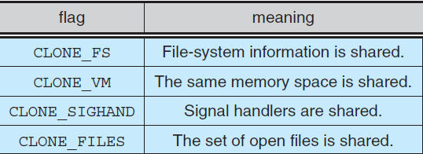
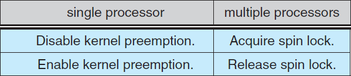
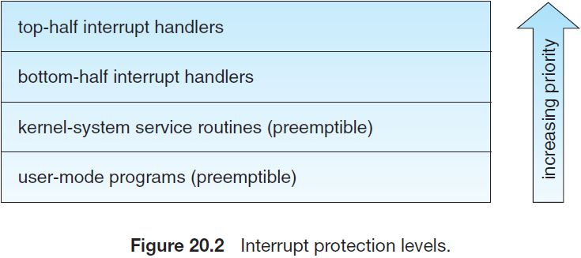
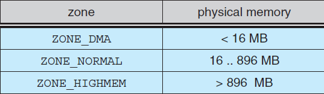
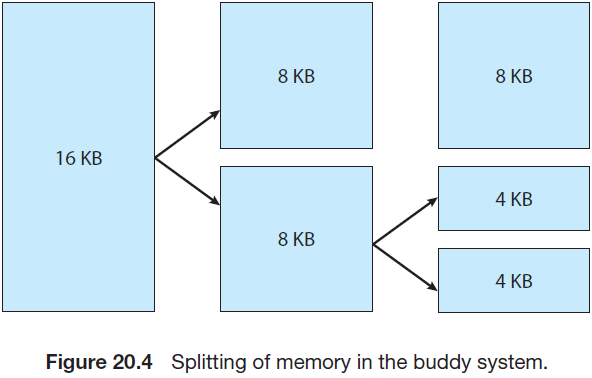
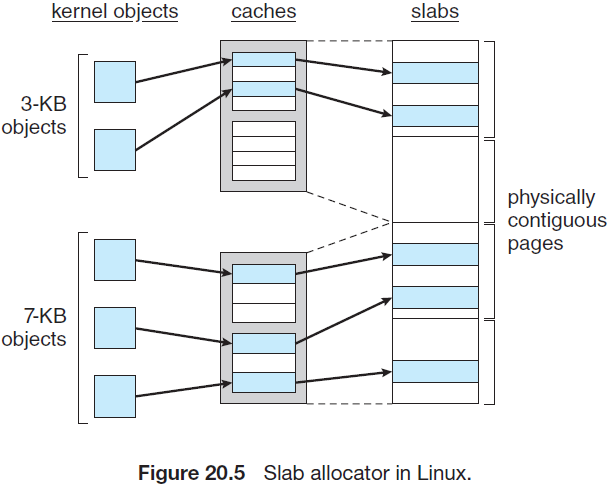

## Linux 系统

本章会深入讨论Linux操作系统。通过研究一个完整的，真实的系统可以看到我们所讨论的概念如何相互联系并与实践相联系。

Linux是一个UNIX变种，并在过去的几十年间流行起来，从一个房间大小的超级计算机变为与移动手机大小的电源设备。本章中，我们会看到Linux的历史和开发，涵盖Linux的用户和编程接口(很大程度上归功于UNIX传统的接口)。我们也会讨论这些接口的设计和实现。Linux是一个快速演化的操作系统。本章会讨论到内核4.12的版本(2017年发布)演进。

### 20.1 Linux History

Linux看起来就跟其他UNIX系统一样，确实，UNIX兼容性作为了Linux下面的主要设计目标之一。然而，Linux比大多数UNIX系统都要年轻。它的开发始于1991年，一个芬兰大学的学生，Linus Torvalds使用80386处理器(因特尔第一个真正的PC兼容的32位处理器)开发了一个小型的自包含内核系统，

在Linux的早期开发中，Linux的源码在因特网上是free的，免费且分配的限制最小。最终，Linux的历史即全世界所有开发者合作的结果，且几乎只通过因特网进行合作。从一个只实现了UNIX系统服务的一部分内核开始，Linux系统已经成长为包含所有期望功能的现代UNIX系统。

在早期时，Linux的开发大部分围绕中央操作系统内核，管理所有系统资源并直接与计算机硬件交互的核心特权功能。当然，我们需要更多的内核功能来使之成为一个完整的操作系统。因此，我们需要区分Linux内核和完整Linux系统之间的区别。Linux内核是由Linux社区负责开发的原始软件。Linux系统包含多个组件，有些组件是从头开发的，有些是从其他开发项目引入的，还有一些是与其他项目组联合开发的。

基本的Linux系统是一个标准的应用环境和用户程序环境，但它不会强制使用任何标准方法来管理所有可用的功能。随着Linux的成熟，在Linux系统之上还需要另一层功能。Linux发行版满足了这种需求。Linux发行版包含所有标准Libux系统的组件，以及一系列简化处理安装和Linux后续升级，管理系统上其他软件包的安装和删除的管理工具。一个现代发行版通常也包含管理文件系统，创建和管理用户账户，网络管理，web浏览器，文字处理器等的工具。

#### 20.1.1 The Linux Kernel

第一个对公众发行的Linux内核版本号为0.01，发行于1991年5月14日。它不包含网络，仅运行在80386兼容的因特尔处理器和PC硬件上，并严格限制了支持的设备驱动。虚拟内存子系统也相当基础，且不支持内存映射文件。然而，即使这样，它仍然支持写时读的共享页和地址空间的防护。由于第一个Linux内核是在Minix平台上开发的，因此唯一支持的文件系统为Minix文件系统。

下一个里程碑为发行为1994年3月14日的Linux 1.0。这个发行版结束了Linux内核三年的快速开发。最大的新特性可能就是网络了：1.0包含了支持UNIX标准TCP/IP的网络协议，以及兼容BSD网络开发的套接字接口。设备驱动也支持在以太网或(PPP或SLIP协议)串口线路或调至调节器上运行IP。

1.0内核也包含了一个新的，增强的文件系统，并不仅仅限于Minix文件系统，并支持了大量SCSI控制器，用于磁盘的高速访问。开发者扩展了虚拟内存子系统来支持使用分页交换文件以及使用内存映射任意文件(但1.0仅实现了只读的内存映射)。

该发行版中也支持了其他硬件。虽然限制了因特尔PC平台，但支持的硬件扩展到软盘和CD-ROM设备，和声卡，各种鼠标和国际键盘。内核为没有80387数学协处理器的80386用户提供了浮点仿真。实现的System V UNIX类型的进程间通信，包括共享内存，信号量以及消息队列。

至此，开始了1.1内核的开发，但在1.0之后修复了大量缺陷，并采用了一种模式作为Linux内核的标准编号约定。小版本号为奇数的内核，如1.1或2.5，为开发的内核。小版本号为偶数的内核为稳定的生产内核。对稳定内核的更新仅限于补丁版本，即开发版本可能会包含新的和相对未测试的功能。正如我们会看到的，这种模式持续到了版本3。

1995年3月发布了1.2版本的内核。该发行版几乎没有提供与1.0版本相同功能上的改进，但支持了更多类型的硬件，包括新的PCI硬件总线结构。开发者添加了另外一个PC特性，即通过80386 CPU的虚拟8086模式来允许为PC计算机仿真DOS操作系统。并通过更新IP实现支持了账户和防火墙。同时也支持内核模块的动态加载和卸载。

1.2版本的内核是最后一个仅支持PC的Linux内核。Linux 1.2发布的源代码包含对SPARC，Alpha和MIPS CPU的实施支持。但是到稳定的1.2内核发布后，才开始完全集成到其他体系结构中。

Linux 1.2发行版主要聚焦支持大量的硬件，以及现有功能的完整实现。此时很多新的功能正处于开发中，但直到1.2稳定版发行之后才将新代码何如到主内核源码中。1.3开发版中将大量的新功能添加到了内核中。

1996年6月发行的Linux 2.0版本发布了这些功能。由于添加了两个主要的新功能，因此增加了主版本号：支持多架构，包括64位的本地Alpha端口，和对称多处理（SMP）支持。此外，后续提升了内存管理代码来为文件系统数据提供了与块设备的缓存无关的统一缓存。由于这种改变，内核大大提升了文件系统和虚拟内存的性能。首次将文件系统缓存扩展到网络文件系统，并支持可写入的文件映射域。其他主要的提升包括增加内部内核线程，公开可加载的模块之间依赖关系的机制，支持按需自动加载模块，文件系统系统配合，和兼容POSIX的实时进程调度类。

1999年继续发布了Linux 2.2。增加了UltraSPARC系统端口。使用更加灵活的防火墙增强了网络，提升了路由和流量管理，支持TCP大窗口和选择确认。可以读取Acorn, Apple和NT磁盘，并使用内核模块的NFS守护进程增强了NFS。为了提高对称多处理器（SMP）的性能，将信号处理，中断和某些I / O被锁定在比以前更高的级别。

2.4和2.6版本的内核支持了SMP系统，日志文件系统，增强了内存管理和块I/O系统。2.6版本修改了线程调度，提供一个高效的O(1)调度算法。此外，2.6内核提供抢占，允许线程在内核模块运行时被抢占。

2011年7月发布了Linux内核3.0。主版本号从2增加到3来纪念Linux二十周年。新特性包括提升虚拟化支持，新的分页写回，提升了内存管理系统，也其他线程调度(完全公平调度，CFS)。

2015年4月发布了Linux内核4.0。这次对主版本的颠簸完全是任意的。Linux内核开发者越来越厌倦了不断增加的小版本号。今天的Linux内核版本除了发行顺序外，不代表其他任何内容。4.0的内核提供支持新的架构，提升了移动功能和很多迭代的改进。本章的剩余内存会聚焦新的内核。

#### 20.1.2 The Linux System

正如之前提到的，Linux内核构成了Linux项目的核心，但其他组件构成了一个完整的Linux操作系统。Linux内核是完全由专门为Linux项目而从头编写的代码组成，很多构成Linux系统的支持软件并不是Linux独有的，而是很多类UNIX操作系统所共有的。特别地，Linux使用了很多Berkeley’s BSD操作系统，MIT’s X Window System和Free
Software Foundation’s GNU项目上开发的工具。

这种工具共享在两个方向上都起了作用，Linux的系统库由GNU项目发起，但Linux社区通过解决遗漏、低效和漏洞大大提升了库。其他组件，如GNC C编译器(gcc)，是Linux已经使用的高质量组件。Linux下的网络管理工具由第一个开发的BSD代码演化而来，但最新的BSD衍生品，如FreeBSD则从Linux上借鉴了代码。例如，因特尔浮点仿真数学库和PC声卡设备驱动。

Linux系统由通过松散网络进行写作的开发者进行维护，由负责维护特定组件完整性的小组或个人组成。使用一些对公的FTP存档站点作为这些组件的标准存储库。文件系统层次结构标准文档也会由Linux社区进行维护，作为保证兼容多个系统组件的一种方式。该表中指定了标准Linux文件系统的布局，确定应在哪个目录名称下存储配置文件，库，系统二进制文件和运行时数据文件。

#### 20.1.3 Linux Distributions

理论上，任何人都可以都可以从ftp站点上获取并编译最新版本的系统组件，这就是早期Linux不得不执行的动作。随着Linux的成熟，很多个体和组织尝试通过提供标准的，预编译的包来降低这些难度。

这些集合或发布不仅仅涵盖基础的Linux系统，通常也包含额外的系统安装和管理单元，以及预编译和可以直接安装的很多常用UNIX工具软件包，如新的服务，web浏览器，文本处理和编辑工具，甚至游戏。

第一个发行版通过提供将所有文件解压到一个适当的位置来管理这些包。然而，现代发布版本中的主要特点之一是先进的包管理。现在的Linux发布包含了允许安装，升级或移除包的包跟踪数据库。

SLS发行版可以追溯到早期的Linux，是第一个可以被识别为完整发行版的Linux软件包集合。尽管SLS可以作为一个独立的实体进行安装，但它缺少现代Linux发行版所期望的包管理工具。Slackware发行版的出现极大提升了整体质量，但它的包管理仍比较弱。实际上，该方式仍然是Linux社区广泛采用的发行方式。

从Slackware发行开始，出现了很多商业和非商业的Linux发行版。Red Hat和Debian是非常著名的发行版，第一个来自支持商业Linux的公司，第二个来自免费软件Linux社区。其他支持Linux的发行版包括Canonical和SuSE等等。由于Linux发行版过多，我们无法在此处列出所有发行版。然而，发行版的多样性并不妨碍多个Linux发行版的兼容性。大多数发行版都使用或至少了解RPM软件包文件格式，以这种格式发布的商业应用可以在任何接受RPM文件的Linux发行版上安装和运行。

#### 20.1.4 Linux Licensing

Linux内核依照GNU通用公共许可证(GPL) 2.0版本协议，其条款由自由软件基金会制定。Linux不是公共领域的软件，公共领域暗示了作者放弃了该软件的版权，但是Linux代码的版权仍由该代码的各个作者拥有。Linux是自由的软件，任何人都可以拷贝，修改并使用任何方式使用它，但需要赠送(或出售)自己的副本。

Linux许可条款的主要含义是，没有人可以在不包含源码的前提下，发行根据Linux创建出的Linux衍生物。GPL下发布的软件仅使用二进制产品进行发行。如果发布的软件包含GPL涵盖的任何组件，在GPL下，必须将源代码与任何二进制发行版一起发布。该限制并不禁止制作(甚至销售)二进制软件发行版，任何人收到二进制文件的同时都可以以合理的发行费用获得源码。

### 20.2 Design Principles

整体设计上，Linux与其他传统的非微内核UNIX实现类似。它是一个使用完全UNIX兼容工具的多用户，抢占式多任务系统。Linux的文件系统继承了传统的UNIX语义，并实现了标准的UNIX网络模型。Linux的内部设计细节深受操作系统开发的历史的影响。

虽然Linux运行在各种平台上，但最初是专门在PC架构上开发的。早期的发展很大一部分取决于个人爱好者，而不依靠资金雄厚的开发或研究机构，因此Linux从一开始就试图从有限的资源中榨取尽可能多的功能。今天，Linux可以运行在具有数百GB的主存以及很多TB的磁盘空间的多处理器机器上，但它仍然能够在16 MB的RAM中运行。

随着PC变得更强大，内存和硬盘变得更偏移，最初极简的Linux内核实现了更多的UNIX功能。速度和效率仍然是重要的设计目标，当最近Linux上的各种聚焦于第三发设计目标：标准化。UNIX多元化实现的代价是为一个系统编写的源码有可能无法在另一个系统上编译或运行。 即使两个不同的UNIX系统上的相同的系统调用，它们的行为也不一定完全相同。POSIX标准包含一组针对操作系统行为方面的规范。此外还有与通用操作系统功能扩展有关的POSIX文档，如进程，线程和实时操作。Linux遵守相关的POSIX规范，目前官方POSIX至少已经认证了两个Linux发行版。

因为Linux为编程人员和用户提供了标准接口，对于熟悉UNIX的人来说，Linux几乎没有什么出人意料的地方。这里我们不会详细介绍这些接口，编程接口参见C.3章节，用户接口参见C.4章节，这些接口属于BSD，但同样适用于Linux。但是，默认情况下，Linux编程接口遵循SVR4 UNIX语义，而不是BSD。如果这两种语义的某些行为明显不同，可以采用一组独立的库来实现BSD语义。

UNIX还存在很多标准，但是根据这些标准对Linux进行全面认证有时会变慢，因为通常需要付费才能获得认证，而且证明使一个操作系统符合大多数标准需要付出客观的费用。然而，由于任何操作系统需要支持支持大量应用程序，因此标准化的实现是Linux开发中的一个重要指标，即便没有经过正式认证。除了基本的POSIX标准，Linux当前也支持了POSIX线程扩展(Pthreads)，以及用于实时过程控制的POSIX扩展子集。

#### 20.2.1 Components of a Linux System

Linux系统包含三个主要的代码块，大部分传统的UNIX实现都要实现如下功能：

1. 内核。内核用于管理操作系统的重要抽象功能，如虚拟内存和进程。
2. 系统库。系统库定义了支持应用与内核交互的标准功能集。这些功能实现了大部分的操作系统功能，这些功能不需要内核代码的全部特权。最重要的系统库是C库，即libc。除了提供标准C库，libc实现了用户模式下的Linux系统调用接口，和其他重要的用户层接口。
3. 系统实用程序。系统使用程序用于执行独立的，特定的管理任务。一些系统使用程序只会运行一次，用于系统某些特性的初始化和配置。UNIX的术语-守护程序会永久运行，用于处理如网络连接的入站响应，接受来自终端的登录请求，以及更新日志文件。

图20.1描述了组成一个完整的Linux系统的各种组件，各组件最重要的区别在于该组件是否是内核组件。所有的内核代码都以处理器的特权模式运行，能够完全访问计算机上的所有物理资源。Linux将这种特权模式称为内核模式。Linux不会在内核中构建用户代码。任何操作系统支持的，但无需在内核模式下运行的代码都会放在系统库中，并以用户模式运行。与内核模式不同，用户只能访问系统资源的一部分。

尽管各种现代操作系统的内核内部都采用了消息传递体系结构，Linux仍然保留了UNIX传统模式：内核是作为一个单一的二进制文件创建的。主要的问题是性能。由于所有的内核代码和数据结构都保存在单一的地址空间中，当一个线程调用一个操作系统功能或当发送一个硬件中断时不需要上下文切换。而且，内核可以在多个子系统间使用想多廉价的C函数调用和不那么复杂的进程间通信(IPC)传递数据和发起请求。单一的地址空间不仅包含核心调度和虚拟内存代码，也包含所有的内核代码，包括所有的设备驱动，文件系统和网络代码。

尽管所有的内核组件都共享同一个熔炉，但仍有模块化的空间。用户应用采用了同样的方式，在运行期间可以加载共享库并输入需要的代码，这样Linux内核可以在运行期间动态地加载(或卸载)。内核代码不需要提前了解到应用可能需要加载的模块，它们是真正独立的可加载组件。

Linux内核构成了Linux操作系统的核心，提供了管理进程和运行线程的所有必要的功能，并提供了系统服务，以便仲裁和受保护对硬件资源的访问。内核实现了一个合格的操作系统的所有特性。然而，Linux提供的操作系统并不是一个完整的UNIX系统，它缺少UNIX的大部分功能和行为，且它提供的功能并不是UNIX应用期望的格式。内核不会直接维护可见的用于运行应用的操作系统接口，相反，应用会调用系统库，进而调用需要的操作系统服务。

系统库提供了很多功能，在最简单的层，它们允许应用对Linux内核执行系统调用。执行一个系统调用涉及将控制从非特权用户模式传递到特权的内核模式。这种传递细节会随着架构而变。系统及会收集需要的系统调用参数，使用特定的格式组织参数，然后发起系统调用。

这些库还可以提供更复杂的版本下的基本系统调用。例如，所有的系统库都实现了C语言的缓冲文件处理功能，相比基本的内核系统调用提供了更高级的文件I/O。这些库还提供了与系统调用完全不对应的例程，如排序算法，数学功能，和字符串处理例程。系统库实现了支持UNIX或POSIX应用程序运行所需的所有功能。

Linux系统包括大量用户模式程序，包括系统实用程序和用户实用程序。系统实用程序包含所有初始化和管理系统所需要的程序，如配置网络接口的程序，可以在系统上添加或移除接口。用户使用程序也是系统的基本操作所必须的，但不需要提升特权运行，它们包括简单的文件管理程序，如拷贝文件，创建目录，编辑文本文件等。一个重要的用户实用程序就是shell，为UNIX系统的标准命令行接口。Linux支持很多shell，最普遍的就是bash。

### 20.3 Kernel Modules

Linux内核能够按照需要加载和卸载任意的内核代码段。这些可加载的内核模块运行在特权的内核模式下，因此能够完全访问其运行的机器的所有硬件能力。理论上，不会限制内核模块可以访问的内容。除此之外，内核模块可以实现设备驱动，文件系统或网络协议。

内核模块之所以方便有几个原因。Linux源码是自由的，因此任何人都可以编译一个修改过的内核，并使用性能启动系统。然而，在开发新的驱动程序时，重新编译，连接和加载完整的内核是一个繁琐的过程。如果使用内核模块，就无需构建一个新的内核来测试一个新的驱动，仅需要编译该区的并加载到已经运行的内核中即可。当然，一旦编写了新的驱动，就可以以模块的方式发布一个模块，这样其他用户就无需重新构建他们的内核。

后一点还有另一个含义。由于使用给了GPL许可证，Linux内核不能在发布时添加专有组件(除非这些组件也使用GPL进行发布，且能够在需要时提供这些组件的源码)。模块接口允许第三方按照自身的需求编写和发布无法在GPL下发布的设备驱动或文件系统。

内核模块允许使用标准的最小内核配置Linux系统，无需构建额外的设备驱动。用户需要的任何设备驱动程序都可以在启动阶段由系统显式加载，或在需要时由系统动态加载，在不用时动态卸载。例如，当一个USB鼠标插入系统时会加载鼠标驱动，当鼠标拔出时会卸载该驱动。

Linux下支持的模块有四个组件：

1. 模块管理系统。允许将模块加载到内存，并与内核其他模块通信。
2. 模块的加载和卸载。属于用户模式实用程序，使用模块管理系统将模块加载到内存中。
3. 驱动注册系统。允许模块通知内核已经有一个新的驱动就绪。
4. 冲突解决机制。允许不同的设备驱动程序保留硬件资源，并保护这些资源，避免被驱动意外使用。

#### 20.3.1 Module Management

加载一个模块不仅仅是将其二进制内容加载到内核内存中，系统还必须确保更新模块引用的内核符号或入口，以指向内核地址空间中的正确位置。Linux通过将模块加载的工作分为两个单独的部分来处理该引用更新：管理内核内存中的模块代码以及处理允许引用的模块符号。

Linux在内存中维护着一个符号表。该符号表不包含内核编译过程中定义的所有符号集，但是必须显式导出符号。导出的符号集构成一个定义明确的接口，模块可以通过该接口与内核进行交互。

虽然从内核函数导出符号需要编程者明确要求，但将这些符号导入一个模块并不需要特殊处理。一个模块编写者只需要使用C语言的标准外部链接即可。任何模块引用但未声明的外部符号会在编译器生成的最终模块二进制文件中被简单地标记为未解决。当内核加载一个模块时，一个系统实用程序会第一扫描这些未解决的引用，在内核的符号表中查找仍需要解析的所有符号，并将这些当前正在运行的内核中的符号的正确地址替换为模块代码。后续内核会加载该模块。如果无法通过查找内核符号表解决所有的模块引用，那么会拒绝该模块。

模块的加载分为两个阶段。首先，模块加载器程序会请求内核为模块预留一块连续的虚拟内核内存区域。内核会会返回分配的内存地址，然后加载程序会使用该地址将模块的机器代码重定位到正确的加载地址。然后，第二个系统调用将模块以及新模块要导出的任何符号表传递给内核。现在，将模块本身原样复制到先前分配的空间中，内核会使用新的符号更新内核符号表，用于其他可能会用到但还没有加载的模块。

最后一个模块管理组件是模块请求器。内核定义了一个用于模块管理程序连接的通信接口。建立连接后，当一个进程请求一个设备驱动，文件系统或网络服务时，如果这服务对应的模块还没有被加载，此时内核会通知管理进程加载这些服务。一旦加载了模块，就可以完成原始的服务请求。管理进程会定期查询内核来检查是否有正在使用的动态加载的模块，并在其不再被使用时卸载该模块。

#### 20.3.2 Driver Registration

一旦加载了模块，它只会作为一个孤立的内存区域，直到内核的其余部分知道它提供了什么新功能。内核维护着所有已知驱动程序的动态表，并提供了一组例程来允许在任何时候将驱动程序添加到这些表中或从中删除。内核确保在模块加载时调用模块的启动例程，并在该模块卸载前调用该模块的清理例程。这些例程负责注册模块功能。

一个模块可能注册很多类型的功能(不仅限于一种类型)。例如，一个设备驱动可能会注册两种不同的用于访问设备的机制。注册表包括如下条目：

- 设备驱动。这些驱动包括符号设备(如打印机，终端和鼠标)，块设备(包括所有的磁盘驱动)，以及网络接口设备。
- 文件系统。可能是实现了Linux虚拟文件系统调用例程的任何文件系统，它可能实现了一种在磁盘上存储文件的格式，但也可能是网络文件系统，如NFS，或根据需要生成的虚拟文件系统，如Linux /proc文件系统。

- 网络协议。可能是实现了完整的网络协议的模块，如TCP，或用于网络防火墙的简单报文规则。
- 二进制格式。该格式定义了一种识别，加载和执行一个新类型的可执行文件的方式。

此外，一个模块可以在sysctl和/ proc表中注册一组新的条目，允许动态配置该模块(20.7.4章节)。

#### 20.3.3 Conflict Resolution

商业UNIX实现通常在供应商自己的硬件上运行。单供应商解决方案的一个优势是，软件供应商能够很好地配置硬件。然而，PC硬件有多种配置方式，且某些设备可能存在大量驱动，如网卡和视频播放适配器。由于当前活动的设备集会动态变化，因而当支持模块化的设备驱动时，管理硬件配置变得愈发重要。

Linux提供了中央冲突解决机制来帮助仲裁对某些硬件资源的访问。其目的如下：

- 防止在访问硬件资源时产生冲突
- 防止自动探测。设备驱动程序探针可以可自动检测设备配置是否干扰了现有设备驱动程序
- 解决多个驱动类型访问相同的硬件时产生的冲突。例如，当并行打印机驱动程序和并行线路IP（PLIP）网络驱动程序都尝试与并行端口通信时。

为此，内核维护了分配的硬件资源列表。PC对I/O端口(硬件I/O地址空间的地址)，终端线路，以及DMA通道的数目进行了限制。当任何设备驱动访问一个资源时，最好先在内核数据库中为其保留资源，这个需求能够让系统管理员在任何时间确定哪个驱动程序确切分配了哪些资源。

期望的模块会使用该机制来预先保留其期望使用的任何硬件资源。如果因为当前资源不存在或正在被使用而拒绝了对资源的预留，后续的处理取决于模块的实现。如果无法继续，则会初始化失败并请求卸载该模块，或继续使用可替代的物理资源运行。

### 20.4 Process Management

进程时操作系统处理用户活动的基本上下文。为了兼容其他UNIX系统，Linux必须使用于其他版本的UNIX类似的进程模型。然而，Linux在几个关键的操作与UNIX不同。本章种，我们会回顾传统的UNIX模型(C .3.2章节)并介绍Linux的线程模型。

#### 20.4.1 The fork() and exec() Process Model

UNIX进程管理的基本原则是将两个操作分为两个步骤，这两个步骤通常合二为一：创建一个新的进程并运行一个新的程序。使用`fork()`系统调用创建一个新的进程，使用`exec()`运行一个新的程序，它们时两个不同的功能。我们可以调用`fork()`创建一个新的进程而不明确地运行该程序(子进程会在父进程运行的同时运行)。类似地，运行一个新的程序不需要创建新的进程。任何进程都可以在任何时候调用`exec()`，将一个二进制对象加载到进程的地址空间后会在现有进程的上下文种开始运行。

该模型的优势是非常简单，它不需要在程序运行的系统调用中详细指定新程序的环境。新程序只需简单地运行在现有环境中。如果父进程期望修改新程序运行的环境，它可以fork子进程，然后在子进程中运行原始可执行文件，并在最终运行新程序前执行系统调用来修改子进程。

UNIX下，一个进程包含操作系统维护跟踪一个程序运行的所有信息。在Linux下，可以将这些上下文分为特点的部分。大致来说，进程属性分为三类：进程标识，环境和上下文。

##### 20.4.1.1 Process Identity

进程标识主要包含如下条目：

- 进程ID(PID)。每个进程都有一个唯一标识符。PID用于在应用发起系统调用来通知，修改或等待进程时指定一个进程。其他标识符将进程和进程组(通常，一个用户命令可以fork一颗进程数)与登陆会话进行关联。
- 凭证。每个进程必须关联一个用户ID以及一个或多个组ID，用于确定一个进程访问系统资源和文件的权限。
- 个性化。传统的UNIX系统上不存在进程的个性，但在Linux中，每个进程关联一个个性标识符，可以可以稍微修改某些系统调用的语义。仿真库主要使用个性来请求与某些UNIX类型兼容的系统调用。
- 命名空间。每个进程都会关联一个特定的文件系统层次结构视图，称为命名空间。大多数进程会共享一个通用的命名空间，并操作一个共享的文件系统层级。然而，进程和子进程(各自具有一个唯一的文件系统层级)可以有不同的命名空间，包括根目录和挂载的文件系统集。

大多数描述符都首先于进程本身的控制。进程组和会话标识符只有在进程期望启动一个新的组或会话时才会发送变化。进程凭证的变化受制于安全检查。然而，进程的主PID不会改变，并保持到进程结束。

##### 20.4.1.2 Process Environment

一个进程的环境继承自父进程，包含两个以null结尾的向量：参数向量和环境向量。参数向量仅仅列出了调用运行的程序所需要的命令行参数，通常以程序的名称开始。环境向量为"NAME=VALUE"的列表，将环境变量于任意文字值关联。环境向量不会保存在内核内存中，它保存在进程的用户模式的地址空间中，作为进程堆栈顶部的第一个数据。

当创建一个新的进程时不会改变参数和环境向量。新的子进程会继承父进程的环境。然而，当执行一个新的程序时会配置一个全新的环境。调用`exec()`时，进程必须为新的程序提供环境向量。内核会将这些环境变量传递到下一个程序，以替换进程当前环境。否则，内核不会改变环境和命令行向量(对这些向量的解析完全依赖于用户模型库和应用)。

将环境变量从一个进程传递到下一个进程，以及子进程继承这些变量的方式提供了灵活的将信息传递到用户模型下的系统软件组件的方法。

各种重要的环境变量对于系统软件的相关部分具有常规含义。各种重要的变量对系统软件的相关部分具有普世意义。例如，`TERM`变量用于设置用户登陆会话的终端类型的名称。很多程序使用该变量来确定如何在用户显示器上执行操作，如移动光标和滚动文档区域。具有多语言支持的程序使用LANG变量来确定显示(包含多语言支持的)程序系统消息的语言。

环境变量机制根据每个进程定制操作系统。用户可以选择各自的语言或选择于其他用户不同的编辑器。

##### 20.4.1.3 Process Context

在进程创建时会设置进程标识和环境属性，并在进程运行时不会改变。一个进程可能会在需要时修改部分标识，或修改环境向量。相反，进程上下文为程序的状态，会不断地变化。进程上下文包含如下部分：

- 调度上下文。进程上下文的最重要的部分时调度上下文，包含了调度器需要暂停并重启进程的信息。这些信息包括保存的所有进程寄存器的副本。保存浮点寄存器需要单独保存，并在需要时恢复。因此，如果不需要浮点运算的进程不会产生保存该状态的开销。调度上下文也包含调度优先级以及任何等待传递到进程的未完成信号的信息。调度上下文的一个重要部分是进程的内核栈，它是内核内存保留给内核模式代码的一段独立区域。在进程执行期间发送系统调用和终端时会使用到该栈。
- 账户。内核维护着当前每个进程使用的资源以及进程的整个生命周期使用的总资源。
- 文件表。文件表为指向打开文件的内核文件结构的指针数组。当执行文件I/O系统调用时，进程会使用一个整数引用文件，称为文件描述符(fd)，内核使用该值索引文件表。
- 文件系统上下文。文件表列出了现有的打开文件，而文件系统上下文则应用于打开新文件的请求。文件系统上下文包含文件的根目录，当前工作目录和命名空间。
- 信号处理表。UNIX系统可以异步地给进程传递信号来响应各种外部事件。信号处理表定义了响应特定信号的动作。有效的动作包括忽略信号，终止进程，唤醒进程地址空间中的例程等。
- 虚拟内存上下文。虚拟内存上下文描述了进程的私有地址内存。见20.6章节。

#### 20.4.2 Processes and Threads

Linux提供了`fork()`系统调用，可以在不加载新的可执行镜像的前提下复制一个进程。Linux也提供了通过`clone()`系统调用创建进程的能力。Linux不会区分进程和线程。实际上，Linux通常会使用任务(task)，而不是进程会线程来直到一个程序中的控制流。`clone()`系统调用的行为与`fork()`类似，但它会接受一组用于标识父进程和子进程之间的共享资源的flag(使用`fork()`产生的进程不会与父进程共享任何资源)。flag包括：

如果`clone()`传入flag `CLONE_FS`, `CLONE_VM`, `CLONE_SIGHAND`，和`CLONE_FILES`时，父和子任务会共享系统的文件系统信息(如当前工作目录)，系统的内存空间，系统的信号处理器，以及系统的打开文件集。由于父任务与子任务共享了大部分资源，因此这种情况下使用`clone()`等价于在其他系统中创建了一个新的线程(*该任务的复制*)。

如果调用`clone()`时没有指定任何flag，则不会共享任何资源，这种情况下与`fork()`系统调用相同。

缺少区分进程和线程的原因可能是因为Linux没有在主进程的数据库里面保存进程的全部上下文。相反，它将上下文保存在独立的子上下文中。因此，一个进程的文件系统上下文，文件描述符表，信号处理表和虚拟内存上下文都保存在独立的数据结构中。进程数据结构简单地包含了指向其他结构的指针，这样任何数量的进程都可以通过简单地指向相同的子上下文来共享该子上下文，并增加引用计数。

`clone()`系统调用的参数指出了需要拷贝和共享的子上下文。新的进程会赋予一个新的标识以及新的调度上下文，这些是Linux进程的基本要素。然而，根据传入的参数，内核可能会创建一个新的自上下文数据结构来作为父任务的副本，或使用与父任务相同的子上下文数据结构。

`fork()`系统调用只是`clone()`的特殊场景，它拷贝了所有的子上下文，而不共享任何子上下文。

### 20.5 Scheduling

操作系统会通过调度将CPU时间分配给不同的任务。Linux和所有的UNIX系统都支持抢占式多任务，这种系统中，进程调度器决定何时允许哪个线程。在多个不同的负载中均衡公平性和性能是现在操作系统中最艰难的挑战之一。

通常我们将调度看作是用户线程的运行和中断，但调度的另一个方面对Linux来说也同样重要：运行不同的内核任务。内核任务包含运行的线程发出的请求以及内核本身内部运行的任务(如Linux I/O子系统产生的任务)。

#### 20.5.1 Thread Scheduling

Linux有两个不同的进程调度算法。一个是公平的时间分片算法，用于在多个线程间执行抢占式调度；另一个用于实时任务，这些任务的绝对任务都高于公平调度。

内核2.6版本中对基于时间片的调度算法进行了重大修该。较早的版本是传统UNIX调度算法的变体。 该算法不能够充分地支持SMP系统，随着系统上任务数量的增长，其扩展性表现不佳，且无法维护在交互式任务间维持公平性，特别是在如桌面系统和移动设备系统上。内核2.5版本中对线程调度进行首次大修，实现了基于常数时间(算法复杂度为O(1))的调度算法，无论系统中有多少任务或处理器。新调度器提升了多SMP系统的支持，包括处理器亲和性和负载均衡。虽然这些修改提升了扩展性，但并没有提高交互性能或公平性。实际上，在特定负载下更加糟糕。最终在不久之后的2.6版本中又对线程调度器进行了大修，该版本引入了完全公平调度器(CFS)。

Linux调度器是一个抢占式的，基于两个不同的优先级范围的算法：0\~99的实时范围，-20~19的nice值范围。小的nice值的优先级更高。因此通过增加nice值，可以降低任务的优先级，使其能够更好地在系统上运行。

CFS背离了传统UNIX的进程调度器。在后者中， 调度算法的一个主要变量是优先级和时间片。时间片的长度就是分配给线程的处理器的一部分。传统的UNIX系统会给与每个进程一个固定的时间片，可能对高优先级或低优先级进程进行提升或惩罚(*高优先级进程可能会抢占低优先级进程，导致高优先级进程获取的时间片过多，低优先级的时间片则被压缩*)。一个进程运行的时间可能等于其时间片长度，但更高优先级的进程会先于低优先级进程运行。很多非UNIX系统都采用了这种简单的算法。这种算法在早期的分时系统中运行良好，但对今天的现代桌面和移动设备来说，该算法提供的交互式性能和公平性开始显现出不足。

CFS引入了一种新的调度算法，称为完全调度，它移除了传统上的时间片概念。所有的进程都会分配到一部分处理器时间。CFS根据可运行线程总数计算线程应该运行的时间。假设有N个可运行的线程，那么每个线程会分配到处理器时间的1/N。CFS可以通过衡量每个线程的nice值调节这种分配。默认nice值的线程的权重为1，这种情况下线程的优先级不会变。具有更小nice值(更高优先级)的线程的权重更高，具有更大nice值(更低优先级)的线程的权重更低。然后，CFS使用与进程的权重除以所有可运行进程的总权重成比例的“时间片”来运行每个线程。

为了计算线程实际运行使用的时间长度，CFS依赖一个可配置的变量，称为目标延迟，等于所有可运行任务至少运行一次的时间。例如，假设目标延迟为10毫秒，且有两个相同优先级的线程，这两个线程的权重相同，因此会分配到相同的处理器时间。这种情况下，第一个进程会运行5毫秒，第二个进程也会运行5毫秒，然后第一个进程再运行5毫秒，以此类推。如果有10个可运行的线程，那么在重复执行这些线程前，CFS会为每个线程分配1毫秒的处理器时间。

但是，如果有1000个线程会怎么样？如果按照上面描述的流程，每个线程会分配到1微妙，考虑到线程切换的成本，使用这点时间调度线程是远远不够的。CFS依赖第二个可配置变量，即最小颗粒度，即分配给所有线程的最小时间长度。所有的线程至少具有等同于最小颗粒度长度的时间(无论目标延迟是多少)。通过这种方式，CFS保证切换成成本不会因为可运行的程序数目的增加而变得不可接受。但这种方式违背了其公平的初衷。然而通常场景下，可运行的线程数目是可接受的，并且公平性和切换成本也都最大化。

提到公平调度，CFS与传统进程调度器的行为有所不同。最为显著的是CFS移除了固定的时间片，相反每个线程会分配到一部分的处理器时间(时长取决于可运行的线程数量)。这种方法解决了抢占式优先级调度算法中优先级到时间片的映射问题。当然，也有可能存在不丢弃经典UNIX调度器的前提下解决这些问题的方式，但CFS使用一种简单算法解决了这些问题，该算法在移动设备等交互工作负载上表现良好，而不会影响最大服务器上的吞吐量性能。

#### 20.5.2 Real-Time Scheduling

对于标准的分时线程来说，Linux的实时调度算法要比公平调度简单的多。Linux实现了两种POSIX.1b下的实时调度类：先进先服务(FCFS)和轮询(分别参见5.3.1和5.3.3章节)。两种情况下，除了调度类之外，每个线程还有一个优先级。调度器总会运行具有最高优先级的线程。如果多个线程具有相同的优先级，则调度等待时间最长的线程。FCFS和轮询调度的唯一不同点是，FCFS线程会一直运行，直到结束或被阻塞，而轮询的线程在运行一段时间后会被抢占，并移动到调度队列的末端，因此具有相同优先级的使用轮询的线程会自动共享时间。

Linux的实时调度是软实时，非硬实时。调度器严格保证了实时线程的相对优先级，但内核不会保证在线程变得可用时能够快速地调度该线程。相反，一个硬实时系统能够保证一个线程在变为可运行和实际运行之间的最小延迟。

#### 20.5.3 Kernel Synchronization

内核调度自己的操作的方式与调度线程的方式完全不同。有两种方式可以请求内核的操作。一个运行的程序可能会通过显示或隐式地指定一个系统调用的方式请求操作系统服务，例如，当发生分页错误时。或者，一个设备控制器可能会传递硬件中断，导致CPU执行一个内核定义的用于处理该中断的处理器。

内核遇到的问题是，所有的任务都可能尝试访问相同的内部数据结构。如果一个内核任务正在访问某些数据结构，而此时执行了中断服务例程，那么该服务就无法在不破坏数据的前提下访问或修改相同的数据。该事实涉及到临界区的概念，即访问共享数据的代码段不能并行执行，导致内核涉及的同步相比线程调度来说要多得多。因此需要一个框架来允许在不破坏共享数据整体性的前提下运行内核任务。

2.6版本之前，Linux是一个非抢占式的内核，意味着，无法抢占一个运行在内核模式的线程，即使有更高优先级的线程可以运行。在2.6版本中，Linux内核完全支持任务的抢占，现在可以抢占一个正在运行的内核任务。

Linux为内核提供了自旋锁和信号量(以及这两个锁的读写版本)。在SMP机器上，根本的锁机制是一个自旋锁，用于保持一小段时间的内核线程。在单处理器机器上，使用启用和禁用内核抢占来替代自旋锁，即，相比使用自旋锁保持线程，任务会直接禁止内核抢占。当一个任务释放自旋锁时，会启用内核抢占。这种模式描述如下：

Linux使用一种有趣的方式来禁止和启用内核抢占。它提供了两个简单的内核接口：`preempt_disable()` 和`preempt_enable()`。此外，如果内核模式的任务正在持有自旋锁，则该任务不能被抢占。为了执行此规则，系统中的每个任务都有一个`thread-info`结构体，包含一个`preempt_count`字段，该字段统计了该任务持有的锁的数目。当获得一个锁时，该计数器会增加，当释放一个锁时，该计数会减少。如果当前运行的任务`preempt_count`值大于0，由于此时该任务持有锁，因此执行内核抢占并不安全。如果该计数为0，则可以安全地中断该任务(假设没有未完成的对`preempt_disable()`的调用)。

自旋锁与启用和禁止内核抢占一样，仅会被内核持有一小段时间。当需要对一个锁持有较长时间，可以使用信号量。

Linux采用的第二个用于临界区的防护技术是中断服务例程。它是处理器的中断控制硬件的基本工具。通过在一个临界区中禁止中断(或使用自旋锁)，内核可以保证在没有并行访问共享数据结构的前提下进行处理。

然而，禁止中断是有惩罚的。在大多数硬件架构上，启用和禁止中断的指令并不廉价。更重要的是，一旦禁止中断，所有的I/O都会被暂停，此时所有等待服务的硬件都会一直等待，直到重新启用中断，因此会降低性能。为了解决这种问题，Linux内核使用了一种同步架构，允许在整个临界区持续时间内运行，而无需禁用中断。这种能力特别适用于网络代码。网络设备驱动的一个中断可以指示一个网络报文的到来，进而触发中断服务例程中的合适的代码进行解包，路由和转发。

Linux通过将中断服务例程划分为两部分实现了这种架构：top half和bottom half。top half是标准的中断服务例程，在禁用递归中断的情况下运行。禁止相同序号(或线路)的中断，但可能允许其他中断运行。服务例程的bottom half运行时，会启用所有的中断，通过微型调度程序确保bottom half永远不会中断自己。当存在中断服务例程时，会自动唤醒bottom half调度器。

这种划分意味着内核可以完成响应一个中断所需要的复杂的处理，而无需担心会中断本身。如果在bottom half运行时产生了另外一个中断，那么新的中断可以请求执行相同的bottom half，但实际的执行会被推迟到当前运行的操作结束为止。每个bottom half的执行都可以被top half中断，但不能被类似的bottom half中断。

top-half/bottom-half体系架构是通过一种机制完成的，该机制用于在执行正常的前台内核代码时禁用选定的bottom halves。内核可以使用这个系统轻松地编写临界区的代码，中断处理程序可以将其临界区编码为bottom halves;；当前台内核需要进入一个临界区时，可以禁用相应的bottom halves来阻止其他临界区被中断。在临界区结束时，内核可以重新启用bottom halves，并运行在临界区运行期间被top-half中断服务例程入队列的bottom-half任务。

图20.2描述了内核中的各种级别的中断防护。每个级别都可能被更高级别的代码中断，但不会被相同会更低级别中断。除了用户模式代码，当发生分时调度中断时，用户线程还可以被其他线程抢占。

#### 20.5.4 Symmetric Multiprocessing

Linux 2.0内核是第一个支持对称多处理器(SMP)硬件的版本，允许线程并行在不同的处理器上。SMP的原始实现限制只能有一个处理器运行内核代码。

在2.2版本的内核中，通过创建单一的内核自旋锁(有时被称为BKL，big kernal lock)来允许在内核中同时(在不同的处理器上)运行多线程。然而，BKL提供了一种非常粗糙的锁机制，导致具有许多处理器和线程的计算机的可伸缩性较差。后续发布的内核通过将单个内核自旋锁切割为多个锁，使得SMP实现更具可伸缩性，每个锁仅保护一小块的内核数据结构，20.5.3描述了自旋锁。

3.0和4.0的内核提供了额外的SMP增强，包括更精细的锁，处理器亲和性，负载均衡算法和支持单一机器上的上百甚至上千个物理处理器。

### 20.6 Memory Management

Linux下的内存管理有两个组件。第一个用于处理申请和释放物理内存，如分页，分页组以及RAM中的小块。第二个用于处理虚拟内存，虚拟内存将内存映射到正在运行的进程的地址空间中。本章中将会描述这两种组件，以及为了响应`exec()`系统调用而将新程序的可加载组件加载到进程的虚拟内存中的机制。

#### 20.6.1 Management of Physical Memory

由于特定硬件的限制，Linux将物理内存划分为如下四种不同的zone，或区域：

- ZONE DMA
- ZONE DMA32
- ZONE NORMAL
- ZONE HIGHMEM

这些zone是架构指定的。例如，在Intel x86-32架构下，特定的ISA(工业标准架构)设备只能使用DMA访问物理内存的低16MB。在这些系统上，物理内存的前16MB包含了ZONE_DMA。在其他系统上，特定的设备只能访问4GB大小的虚拟内存，除非支持64位的地址。在这类系统上，物理内存的前4GB包含ZONE_DMA32。ZONE_HIGHMEM(用于高端内存)是指未映射到内核地址空间的物理内存。例如，32位Intel 架构(2^32^提供了4GB的地址空间)上，将前896MB的地址空间映射到内核。剩余的内存为从ZONE_HIGHMEM分配到的高端内存。最后，ZONE_NORMAL包含了其他的所有内存，即正常的、定期映射的分页。一个架构是否存在某个zone取决于该架构的限制。一个现代的64位架构，如Intel x86-64有一个小的16MB ZONE_DMA(用于延迟设备)，其他内存则为ZONE_NORMAL，没有高端内存。

图20.3展示了Intel x86-32架构下的zone和物理内存的关系。内核维护了每个zone下的空闲分页。当请求物理内存时，内核会使用合适的zone去满足该请求。

Linux内核中的主要物理内存管理器位分页分配器。每个zone都有自己的分配器，用于该zone下的物理分页的分配和释放，并根据请求分配连续的物理分页。分配器使用伙伴系统(10.8.1章节)来根据可用的物理分页。本架构下，相邻的可分配内存单元配对在一起(正如其名)。每个可分配的内存区域都有一个相邻的同伴或伙伴。当两个分配的同伴区域被释放后，它们会结合成一个大的区域，一个伙伴堆。大的区域也有一个同伴，可以结合成一个更大的空闲区域。最终，如果现有的小内存区域无法满足一个一个小的内存请求，那么一个更大的空闲区域会被细分为两个同伴来满足该请求，并使用单独的链表来记录每个可用大小的空闲内存域。Linux中，该机制下的最小可用大小为一个物理分页。图20.4展示了伙伴堆分配的例子。分配了一个4KB的域，但最小可用的域为16KB，会递归地分割该区域，直到找到与所需大小相同的域。

不幸的是，Linux内核中的所有内存分配要么是静态的，在系统启动阶段由驱动预留的一段连续内存；要么由分页分配器动态分配。然而，内核函数无需使用基础分配器来预留内存。一些特殊的内存管理子系统会使用底层分页分配器来管理它们的内存池。最重要的是虚拟内存系统，20.6.2章节描述了`kmalloc()`变量长度分配器，用于分配内核数据结构的slab分页器，以及用于缓存文件分页的文件缓存。

很多操作系统的组件需要根据请求分配整个分页，但通常仅会用到很小的内存块。内核为任意大小(无法事先知道请求的大小，有可能只需要很少的字节)的请求提供了额外的分配器。类似C语言的`malloc()`函数，该`kmalloc()`服务根据需要分配了整个物理分页，然后将其分割为小部分。内核维护了使用`kmalloc()`服务申请的分页列表。内存分配涉及确定合适的列表(使用列表中第一个可用的空闲部分或分配一个新的分页，然后将其分割)。使用`kmalloc()`系统声明的内存域会被永久申请，直至明确使用`kfree()`进行释放。`kmalloc()`系统不会重新申请或重新声明这些域来回应内存短缺。

Linux采用的另一种分配内核内存的方式称为slab分配。slab用于给内核数据结构分配内存，它由一个或多个连续的物理分页构成。一个缓存包含一个或多个slab。每个内核数据结构只有一个单一的缓存，例如，与进程描述符数据结构有关的缓存，文件对象的缓存，inode的缓存等等。每个缓存都填充有对象，这些对象是缓存表示的内核数据结构的实例化。例如，表示inode的缓存保存了inode结构的实例，表示进程描述符的缓存保存了进程描述符结构的实例。图20.5描述了slab，缓存和对象的关系。该图展示了两个3KB大小的对象，以及3个7KB大小的对象。这些对象保存在表示3KB和7KB对象的缓存中。

slab分配算法使用缓存来保存内核对象。当创建一个缓存时，会将一些对称分配到该缓存中。缓存中对象的数量取决于相关的slab的大小。例如某一个12KB的slab可以保存6个2KB的对象。一开始，缓存中的所有对象都被标记为空闲。需要一个新的内核数据结构对象时，分配器可以从缓存中分配空闲的对象来满足请求，这些缓存中被分配的对象被标记为已使用。

考虑一个场景，slab分配器请求一个表示进程描述符对象的内存。在Linux系统中，进程描述符的类型为`struct task struct`，需要大概1.7KB的内存。当Linux内核创建一个新的任务时，它需要从缓存中为`struct task struct`对象请求内存。缓存会使用一个已经分配到slab中且被标记为空闲的`struct task struct`对象来满足该请求。

在Linux中，一个slba可能有如下三个状态之一：

1. 全部。slab中的所有对象都被标记为已使用
2. 空。slab中的所有对象都被标记为空闲
3. 部分。slab包含已使用和空闲的对象。

slab分配器会首先使用部分slab中的空闲对象来满足请求。如果不存在，则会从空闲slab中分配空闲的对象。如果空闲的slab也无法满足，则会从连续的物理分页中申请一个新的slab，并分配给缓存，然后从这个slab中分配对象。

Linux中的其他两个子系统会管理各自的物理分页：分页缓存和虚拟内存系统。这些系统彼此间关系密切。分页缓存主要用于文件缓存，用于到块设备的I/O。所有类型的文件系统，包括基于裸Linux磁盘的文件系统，NFS网络文件系统，都会使用分页缓存执行I/O。分页缓存保存了整个文件内容页，并不受块设备的限制，也缓存了网络数据。虚拟文件系统管理着每个进程虚拟地址空间的内容。这两个系统相互关联，因为将一个数据页读取到分页缓存需要使用虚拟内存系统将分页映射到分页缓存中。在后续的章节中，我们会详细讲解虚拟内存系统。

#### 20.6.2 Virtual Memory

Linux虚拟内存用于维护每个进程的地址空间，按需创建虚拟内存并管理着如何从磁盘加载这些页以及在需要是将其交换到磁盘。在Linux中，虚拟内存管理器维护者两个不同的进程地址空间视角：不同的域集，和分页集。

地址空间的第一个视角为逻辑视角，描述了虚拟内存系统收到的有关地址空间布局的指令。在这个视角下，地址空间由不交叉的域组成，每个域代表了一个连续的，按页对其的地址空间的子集。内部的`vm_area_struct`结构体描述了每个域，并定义了域的属性，包括进程的读写和执行权限以及与域相关的文件信息。每个地址空间的域都连接到一颗平和二叉树上，用于快速查找与任何虚拟地址对应的域。

内核也维护了第二个，物理视角下的地址空间，进程的视角保存在物理页表中。页表项表示了虚拟内存每个页的当前地址，无论在磁盘还是物理内存中。物理视角由一组例程进行管理，当一个进程尝试访问当前不在页表中的页时，内核软件中断处理器会唤醒这些例程。地址空间中的`vm_area_struct`描述包含一个字段，该字段指向为任何给定虚拟内存区域实现主要页管理功能的函数表。所有对不可用页的读取或写入请求最终都会被分派到`vm_area_struct`的函数表中的相应处理程序，这样中央内存管理例程就无需知道管理每个内存域类型的细节。

#### 20.6.2.1 Virtual Memory Regions

Linux实现了几种类型的虚拟内存域。虚拟内存的一个特性是区域的后端存储，描述了域的页的由来。大多数内存域要么使用文件作为后端，要么没有后端。没有后端的域是最简单的虚拟内存域类型。这种域表示零需求内存：当一个进程尝试读取位于一个域中的页时，会简单地返回一个填充有零的内存页。

使用文件作为后端的域充当该文件部分的视口。当进程尝试访问位于该域的页时，页表会使用内核页缓存中与文件中相应偏移量对应的页地址进行填充。页缓存和进程的页表都会使用相同的物理内存页，这样文件系统对文件的修改都会体现到该文件映射到的进程中。任何进程都可以映射相同文件的相同域，最终会使用相同的物理内存页。

虚拟存储区还通过其对写入的反应来进行定义。映射到进程的地址空间的域可以是私有的，也可以是共享的。如果一个进程写入一个私有的映射域，pager会检测到需要一个写时拷贝来将变更保留在进程本地。相反，写入一个共享的域会导致更新映射到该域的对象，这样对该对象的修改会立即体现到映射该对象的进程中。

#### 20.6.2.2 Lifetime of a Virtual Address Space