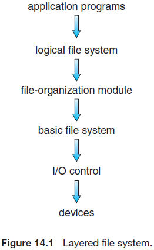
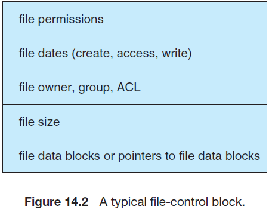
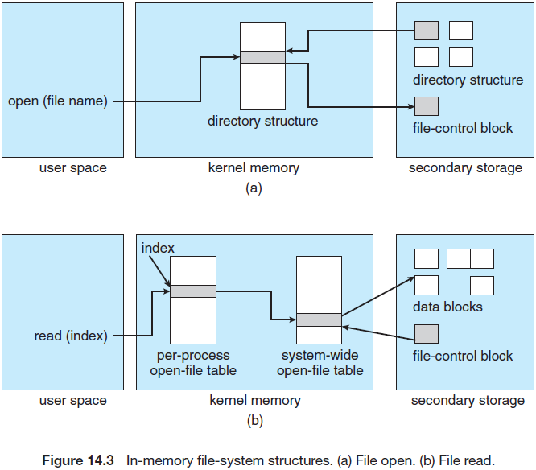
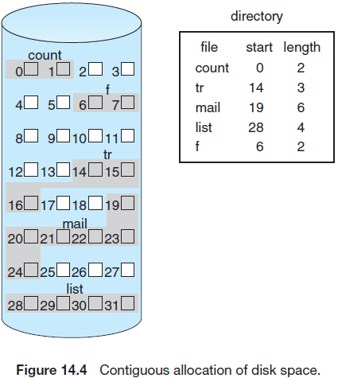
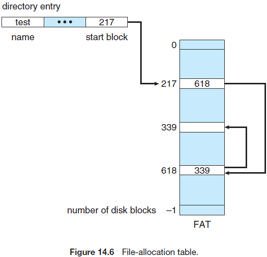
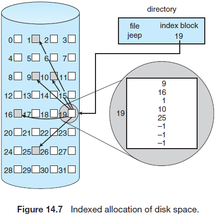
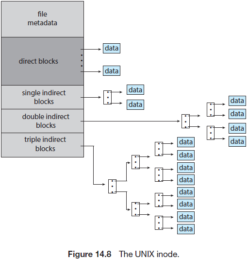
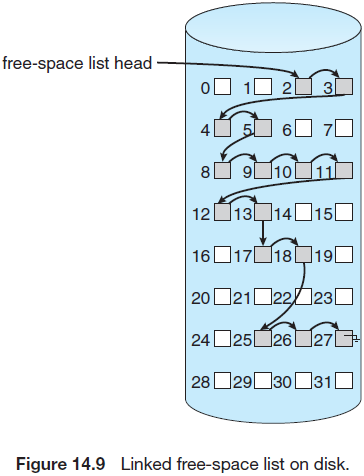
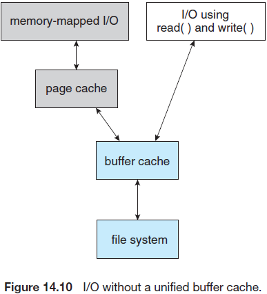
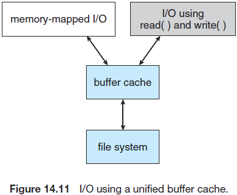

## File -System Implementation

在13章节中可以看到，文件系统提供了在线存储和访问文件内容(包括数据和程序)的机制。文件系统通常永久驻留在辅助存储上，辅助存储用于保存大量数据。本章节主要关注在最通用的辅助存储媒体，硬盘驱动和非易失性存储设备上的问题。我们会介绍几种方法来构建使用的文件，分配存储空间，回收空闲空间，追踪数据位置，以及其他操作系统提供给辅助存储的接口。本章中会涵盖性能相关的内容。

一个给定的通用操作系统提供了多种文件系统。此外，很多操作系统允许管理员或用户添加文件系统。为什么会有这么多文件系统？不同的文件系统在很多方面都不相同，包括特性，性能，可靠性，设计目标，不同的文件系统用于不同的场景。例如，一个临时文件系统用于快速存储和检索非持久性文件，而默认的辅助存储文件系统(如Linux ext4)会为了可靠性和其他特性而牺牲性能。正如我们在整个操作系统研究中看到的，有很多选择和变化，使得全面涵盖这些内容称为一个挑战。本章中，我们关注文件系统的共同点。

### 14.1 File-System Structure

文件系统维护的大多数辅助存储是磁盘，主要有两方面的原因：

1. 磁盘可以重写，可以从磁盘中读取块，修改该块并写回到相同的块
2. 磁盘可以直接访问包含的任何块中的信息。因此，可以简单地使用顺序或随机方式访问文件。从一个文件切换到另一个文件会导致驱动移动读-写磁头，并等待媒介旋转。

非易失性内存（NVM）设备越来越多地用于文件存储，并作为文件系统的存储位置。它们与硬盘的不同之处在于它们无法被重写且具有不同的性能特点。我们在11章节中讨论了磁盘和NVM设备结构的细节。

为了提升I/O效率，内存和大存储间的传输以块为单位。硬盘上的每个块都有一个或多个扇区。根据磁盘驱动，扇区大小通常是512字节或4096字节。NVM设备的块通常是4096字节，传输方式类似于磁盘驱动使用的传输方式。

文件系统通过允许存储，定位，检索数据的方式高效便捷地访问存储设备。第一个问题定义了文件系统如何面向用户，该任务涉及定义一个文件和文件属性，文件允许的操作以及组织文件的目录结构。第二个问题是创建算法和数据结构来将逻辑文件系统映射到物理辅助存储设备。

文件系统本身包含多个不同的层级，图14.1展示了一个层级设计，该设计中的每一层都会使用低一层的特性来创建高一层的特性。

I/O控制层使用设备驱动和中断处理器在主存和磁盘程序间传输信息。一个设备驱动可以看做是一个翻译。它的输入包括高级别命令，如"检索块123"。输出为低级别的，硬件处理器使用的特定硬件指令，用于将I/O设备连接到系统的其他部分。设备驱动通常会通过写入I/O控制器内存中的特定比特位来告诉控制器需要处理设备的哪个位置，以及处理动作。第12章节描述了设备驱动和I/O基础设施的细节。

基本文件系统(在Linux中称为"块I/O子系统")仅需要向相应的设备驱动程序发出通用命令，以读取和写入存储设备上的块。它会基于逻辑块地址向驱动发送命令，也会涉及I/O请求的调度。本层也需要管理内存缓冲和缓存来保存各种文件系统，目录和数据块。会在传输一个大存储块前给缓冲分配一个块。当缓冲满后，缓冲管理器必须找到更多的缓冲内存或释放缓冲空间来完成一个请求的I/O。缓存用于保存文件系统经常使用的元数据来提升性能，因此，管理这些内容对于优化系统性能至关重要。

文件组织模块知道文件和文件的逻辑块，每个文件的逻辑块标记为从0到N。文件组织模块也包含空闲空间管理器，用于跟踪未定位的块，并在请求时将这些块提供给文件管理模块。

最后，逻辑文件系统管理元数据信息。元数据包含所有文件系统结构(除实际数据外)。逻辑文件系统通过管理目录结构来提供文件组织模块，提供后者需要的信息，并给出一个符号文件名。逻辑文件系统会通过文件控制块维护文件结构。一个文件控制块(FCB)(UNIX文件系统中为inode)包含关于文件的信息，包含所有者，权限和文件内容位置。逻辑文件系统也负责防护，见13到17章节。

当文件系统使用层级结构实现时，代码的重复被最小化。多文件系统可以使用I/O控制和基本文件系统代码。每个文件系统可以有自己的逻辑文件系统和文件组织模块。不幸的是，层级也会引入更多的操作系统开销，导致性能下降。使用层级，包括确定使用多少层级和每个层级需要做什么，是新系统设计时面临的主要挑战之一。

当今使用了很多文件系统，大多数操作系统支持多个文件系统。例如，大多数CD-ROM使用IOS 9660格式编写，该格式是CD-ROM厂商所支持的标准格式。除可移动媒体文件系统外，每个操作系统会有一个或多个基于磁盘的文件系统。UNIX使用UNIX文件系统(UFS)，该系统基于Berkeley Fast File System(FFS)。Windows支持FAT, FAT32, 和NTFS (orWindows NT File System)的磁盘文件格式，以及CD-ROM和DVD的文件系统格式。虽然Linux支持超过130种不同的文件系统，标准的Linux文件系统被认为是可扩展的文件系统，但大多数版本使用ext3和ext4。此外还有分布式文件系统，可以被一个或多个客户端计算机通过网络进行挂载。

文件系统的研究会继续作为操作系统设计和实现的热门领域。Google创建了自己的文件系统来满足公司的特定存储和检索需求，并在有很多客户请求接入大量磁盘时保持高性能。另外一个有趣的项目是FUSE文件系统，该文件系统提供了文件系统开发上的灵活性，并允许在用户层(非内核层)实现和执行文件系统。使用FUSE时，用户可以给给中操作系统添加新的文件系统，并使用添加的文件系统来管理文件。

### 14.2 File-System Operations

正如13.12章节中描述的，操作系统使用`open()`和`close()`系统调用来处理文件内容的访问请求。本章中，我们会深入文件系统的结构和操作。

#### 14.2.1 Overview

实现一个文件系统会用到一些存储和内存结构。这些结构根据操作系统和文件系统的不同而不同，但会遵循一些通用的原则。

文件系统的存储会包含如何启动操作系统的信息，总的块数，空闲的块数和位置，目录结构和个别文件。本章中剩余部分会详细讲解这些结构的细节。这里先简单介绍一下：

- 启动控制块(单个卷)包含启动操作系统所需要的信息。如果磁盘不包含一个操作系统，则该块可以为空。该控制块通常是卷中的第一个块。在UFS中称为启动块，在NTFS中名称为分区引导扇区。
- 卷控制块(单个卷)包含卷的详细信息，如卷中的块数，块大小，空闲块数和空闲块指针以及空闲的FCB数和FCB指针。在UFS中称为超级块，在NTF中保存在主文件表中。
- 目录结构(单文件系统)用于识别文件。在UFS中，它包含文件名称和相关的inode数，在NTFS中，保存在主文件表中。
- 单文件FCB包含文件的很多详细信息。它包含与目录表项相关的唯一标识符。在NTFS中，该信息实际上保存在主文件表中，它使用关系数据库结构，每个文件一行。

内存信息用于文件系统管理和性能提升(使用缓存)。这些数据会在挂载时加载到内存中，并在文件系统操作期间进行更新，在卸载时丢弃。可能会包含几种结构类型:

- 内存的挂载表包含每个挂载卷的信息
- 内存目录结构缓存中包含最近访问的目录信息。(对于挂载卷的目录，它包含指向卷表的指针。)
- 系统级打开文件表包含每个打开文件的FCB副本，以及其他信息
- 单进程打开文件表包含指向特定的系统级打开文件表项的指针，以及该进程打开的所有文件的信息。
- 当从文件系统中读取或写入文件系统时保存文件系统块的缓冲

为了创建一个新文件，进程会调用逻辑文件系统。逻辑文件系统知道目录结构的格式。为了创建一个新的文件，需要分配一个新的FCB。(或者，如果文件系统实现了在文件系统创建时创建所有FCB，则会用空闲的FCB中分配一个FCB。)系统会将特定的目录读取到内存，使用新文件名和FCB更新该目录，并将其写回到文件系统。图14.2展示了一个典型的FCB。

一些操作系统，包括UNIX，除了"类型"字段标识为目录外，会将一个目录视为一个文件，其他操作系统，包括Windows，为文件和目录实现了独立的系统调用，将目录与文件区分开来。  无论更大的结构性问题是什么，逻辑文件系统都可以调用文件组织模块将目录I/O映射到存储块位置，然后将其传递到基本文件系统和I/O控制系统。

#### 14.2.2 Usage

创建完文件后，就可以用于I/O。首先通过调用`open()`将文件名传递给逻辑文件系统来打开该文件。`open()`系统调用首先会从系统级打开文件表中查找是否该文件已经被其他进程使用。如果是，则会创建一个单进程打开文件表，并指向现有的系统级打开文件表。这种算法可以节省后续的开销。如果文件没有被打开，会使用给定的文件名来查找目录结构。目录结构的一部分通常会缓存在内存中来加快目录操作。一旦找到文件，会将FCB拷贝到内存中的系统级打开文件表中。该表不仅会保存FCB，也会跟踪打开该文件的进程数。

然后，会在单进程打开文件表中创建一个表项，包含一个指向系统级打开文件表项的指针，以及其他字段。这些字段可能包含指向文件当前位置的指针(用于`read()`或`write()`操作)以及打开文件的访问模式。`open()`调用会返回一个指向单进程文件系统表项的指针。所有的文件操作都会通过该指针执行。由于一旦磁盘中存在对应的FCB，系统就不会用到文件名，因此文件名可能不是打开文件表的一部分(虽然可以通过缓存该字段来节省后续打开该文件的时间)。表项中的名字可能会变化。UNIX系统指文件描述符；Windows指文件句柄。

当一个进程关闭文件时会移除单进程表项，并降低系统级表项的打开数。当所有打开该文件的用户关闭该文件后，所有更新的元数据会拷贝回基于磁盘的目录结构，并移除文件系统级的打开文件表项。

不能忽视文件系统结构的缓存。大多数系统将有关打开文件的所有信息（实际数据块除外）保留在内存中。BSD UNIX系统通常在保存磁盘I/O的地方使用高速缓存。85%的平均缓存命中率表明这些技术还是很有价值的。附录C描述了BSD UNIX系统。

图14.3描述了一个文件系统实现的操作结构。

### 14.3 Directory Implementation

目录分配和目录管理算法会严重影响到文件系统的效率，性能和可靠性。本章中，我们会讨论如何权衡这些算法。

#### 14.3.1 Linear List

实现一个目录最简单的方式是使用线性文件列表和指向数据块的指针，可以简单地编程实现该方式，但在执行时比较耗时。为了创建一个新的文件，首先必须搜索目录来保证不存在相同名字的文件。然后，在目录尾添加一个新的表项。为了删除一个文件，需要搜索目录来找到该文件，然后释放分配给该文件的内存。为了重用目录表项，我们可以做一些处理。我们可以将该表项标记为不可用(通过分配一个特定的名字，如空名字，分配一个无效的inode号(如0)，或在表项中包含一个使用-未使用比特位)，或将其附加到空闲目录表项中。第三种选择时将目录中的最后一个表项拷贝到空闲的位置，并降低目录长度。连接列表可以降低删除文件的时间。

线性目录表项的缺点是，当查找一个文件时需要执行线性查找。由于会经常使用到目录信息，且如果访问过慢，用户会注意到这种情况。实际上，很多操作系实现了一个软件来保存最近使用的目录信息。一个缓存命中可以避免从辅助存储中重新读取信息。有序列表可以使用二分查找来降低平均查找时间。然而，由于不得不移动大量的目录信息来维护一个有序的目录，因此对列表进行排序会使得文件的创建和删除复杂化。使用比较复杂的树数据结构，如平衡树，可能会有所帮助。有序列表的优势是对目录进行列表排行不会产生其他排序过程。

#### 14.3.2 Hash Table

另一种文件目录使用的数据结构是哈希表。这里使用线性列表保存目录表项，也会使用哈希数据结构。哈希表会使用一个从文件名计算出的数值来返回指向线性列表中的文件名指针。因此，可以大大降低目录查找时间。插入和删除也比较直接(尽管必须预防哈希碰撞)。

使用哈希表的最大困难是哈希表的长度通常是固定的，且哈希函数依赖表长度。例如，假设线性探测的哈希表有64个表项。哈希函数会将文件名转换为从0到63的整数(例如，用除以64的余数)。如果后续尝试创建第65个文件，我们必须扩大目录哈希表，例如扩大为128，导致我们需要一个新的哈希函数来将文件名映射到0到127，且需要识别现有的目录表项来反映新的哈希函数值。

或者，我们可以使用链式溢出哈希表。每个哈希表项包含一个链接的列表，而非独立的值，我们可以通过将新的表项添加到链接列表的方式解决碰撞。由于查找一个文件困难需要处理冲突表项的链接列表，因此可能会降低查找速度。尽管如此，该方法也比线性查找整个目录快得多。

### 14.4 Allocation Methods

辅助存储的直接访问方式提供了文件实现上的灵活性。几乎在所有场景中，很多文件会保存在相同的设备中。主要的问题是如何为这些文件分配空间来保证存储空间的高利用率，以及文件的快速访问。最常用的三种主要的辅助存储分配方式为：连续，链接和索引。每个方法都有优势和劣势。虽然一些系统会使用这三种方式，但通常一个系统只会为一种文件类型使用一种方式。

#### 14.4.1 Contiguous Allocation

连续分配需要每个文件占用设备上的连续块。设备地址定义为一个线性的顺序。使用这种顺序时，假设只有一个任务访问设备，在块b之后访问块b+1通常不会需要头部移动。当需要头部移动时(从一个柱面的最后一个扇区移动到下一个柱面的第一个扇区)，只需要头部从一个轨道移动到下一个。因此，对于HDDs，需要访问连续分配的文件的磁盘的查找数是最少的(假设相邻的逻辑地址的块在物理上也是相邻的)。

文件的连续分配由第一个块的地址和文件的长度(单位为块)定义。如果文件为n个块大小，且起始位置为b，那么它占用的块为b, b + 1, b + 2, ..., b + n − 1。每个文件的目录表项标识起始块的地址和为此文件分配的区域的长度(图14.4)。很容易实现连续分配，但也有限制。现代操作系统中没有采纳这种方式。

访问一个连续分配的文件是很简单的。对于顺序访问，文件系统会记录最后一个块地址，并在需要时读取下一个块。对于直接访问一个起始于块b的文件的块i，我们可以理解访问块b+i。这样连续分配可以同时支持顺序和直接访问。

然而，连续分配存在一些问题。一个困难是如何找到新文件需要的空间。选择用来管理空闲空间的系统决定了该任务的完成方式。14.5章节中讨论了这些管理系统。可以使用任何一种管理系统，但一些系统要比其他慢。

连续分配问题可以看作是第9.2节中讨论的存在一般动态存储分配问题的特殊应用，涉及如何使用空闲列表来满足一个大小为n的请求。首次匹配和最佳匹配是最常用的策略，用于从可用存储中选择一个空闲存储。仿真表明，首次匹配和最佳匹配在时间和存储利用率上都要优于最差匹配。在存储利用率方面，首次匹配和最佳匹配都不明确，但首次匹配通常比较快。

所有这些算法都存在外部碎片的问题。由于文件的分配和删除，空闲的存储空间会被分割为小块。当空闲空间被分割为小块时就会存在外部碎片。当请求一个大的连续块时会导致问题。存储被分片为小部分，但没有任何一块能够满足数据存储。取决于总的磁盘存储和平均文件大小，外部碎片造成的问题可大可小。

一种防止外部碎片造成的存储丢失的策略是将整个文件系统拷贝到另一个设备，然后释放源设备，在创建一个大的连续空闲空间，最后通过分连续的空间来将文件拷贝回原设备。这种方案有效地将所有空闲空间压缩为一个连续空间，解决了碎片问题。然而压缩的代价是时间，对于大型存储设备来说，花费的时间会特别大。压缩这些设备可能会花费数小时甚至数周。使用该功能时，一些系统可能需要下线来卸载文件系统。在下线期间，通常无法对系统进行操作，因此使用压缩需要避免生产机器造成的损失。大多数现代系统需要在线执行去碎片操作，但会严重影响到性能。

连续分配的另一个问题是确定一个文件需要多少空间。当创建文件时，必须分配该文件需要的所有空间。那么创建者如何知道所创建的文件大小呢？在一些场景下，确定这文件大小会比较简单(例如，拷贝现有文件)。但通常很难确定一个输出文件的大小。

如果分配给一个文件的空间过小，可能会导致无法扩展文件。特别是使用最佳匹配分配策略时，文件两端的空间都可能正在使用中，这样就无法扩展文件的空间。此时可以采用两种措施，首先终止用户程序，并返回合适的错误信息，然后，用户必须分配更多的空间并重新运行该程序。这些重复的运行可能会付出高昂的代价。为了防止发生这种情况，用户需要高估所需要的空间大小，导致相当大的空间浪费。另一种措施是找到一个大的可用空间，将文件的内容拷贝到该空间，然后释放之前的空间。只要有可用的空间，就可以重复执行这些操作(虽然会花费时间)。但是当执行这些操作时，系统不会通知用户(尽管系统会变得越来越慢，但仍然会忽略这些问题)。

即使能够提前知道一个文件需要的空间大小，也无法预先分配足够的空间。一个文件会随着时间逐渐变大，但必须给该文件分配其最终大小的空间，即使这些空间在很长时间内不会被使用。这样会导致该文件的内部碎片。

为了减小这些缺陷，操作系统可以使用一个修改过的连续分配方案。这里，初始时会分配一段连续的空间块。如果后续发现分配的空间不足，会分配另一端连续的空间，称为扩展区。这样，文件的块被记录为一个位置和一个块数，以及指向下一个扩展区的第一个块的链接。在一些系统上，文件所有者可以设置扩展大小，但如果所有者不正确，该设置会导致效率低下。如果扩展区过大可能会导致内部碎片，而不断申请释放大小变化的扩展区则会导致外部碎片。商业的Symantec Veritas文件系统会使用扩展区来优化性能。Veritas是标准UNIX UFS的高性能替代品。

#### 14.4.2 Linked Allocation

链接分配解决了连续分配的所有问题。使用链接分配时，每个文件都会有一个存储块链接列表，而这些存储块可能分布在设备的任何地方。目录包含一个指向文件首和文件尾的指针。例如，一个文件有5个块，为块9，16，1，10，25(见图14.5)。每个块包含一个指向下一个块的指针，用户无法使用这些指针。因此，如果每个块大小为512字节，且每个块地址(指针)为4字节，那么用户看到的块为508字节。

为了创建一个新文件，我们仅需要在目录中创建一个新表项。使用链接分配，每个目录表项包含一个指向文件的第一个块的指针。该指针初始为空(列表的最后一个指针值，null)来表示一个空文件。长度设置为0。向文件写入时会触发空闲空间管理系统查找一个空闲的块，然后写入该块，并将该块连接到文件尾。为了读取一个文件，仅需要按照指针从一个块读向下一个块即可。使用链接分配时不会产生外部碎片，且可以用空闲空间列表上的空闲块来响应请求。在文件创建时不会声明文件的大小，只要有空闲的块，文件就可以继续变大，同时不需要对磁盘空间进行压缩。

链接分配看起来没有任何缺点，但是它的主要问题是仅能用于顺序访问的文件。为了查找文件中的第i个块，我们必须从文件起始块开始沿着指针找到第i个块。每次对指针的访问都需要一次存储设备的读，有时会使用HDD查找(*部分缓存情况下*)。因此连接分配的文件无法有效地支持直接访问。

另外一个缺点是指针需要占用空间，如果在512字节的块之外还需要给指针分配4字节的空间，那么磁盘的0.78%将会分配给出指针，而非实际数据。每个文件请求的空间都会稍大于其实际使用的空间。

解决这种问题的通常办法是将块收集起来，称为集群，并分配集群，而非块。例如，文件按系统可能会定义一个具有4个块的集群，并在辅助存储上以集群为单位进行操作。这样指针占用的文件空间比例会更小。该方法使得逻辑到物理块映射保持简单的同时，提升了HDD吞吐量(因为减少了磁头的寻址)并降低了块分配以及空闲列表的管理所需要的空间。由于一个集群的部分空间满时会比一个块的部分空间满时更加浪费空间，因此这种方式的代价是增加了内存碎片。而且当随机I/O请求一小部分数据时，也会因为需要传输大量数据而造成性能上的损失。集群可以用于给很多算法提升磁盘访问时间，因此大多数文件系统会采纳这种方法。

链接分配的另一个问题是可靠性。文件通过散布在整个磁盘上的指针链接到一起，操作系统软件的缺陷或硬件问题可能会导致选择错误的指针，进而导致链接到空闲空间列表或其他文件。一种解决方式是使用双链表，另外一个链表用于存储文件名和每个块的相对块号。然而，这种方案的开销更大。

链接分配的一个变种为文件分配表(FAT)。MS-DOS操作系统采用给了这种简单但高效的磁盘空间分配方式。每个卷起始的一段存储单独用于保存表。表中的每个表项对应一个块，使用块号进行索引。FAT的使用方式与链接列表相同。目录表项包含文件的第一个块的块号，而该块号索引的表条目包含文件中下一个块的块号，链表以这种方式组织，直到最后一个使用特殊的文件末尾值作为表项的块。未使用的块对应的表项值为0。给一个文件分配一个新的块也比较方便，找到第一个0值的表项，然后使用该块替换之前的文件末尾值，最后加上表示文件末尾的0值即可。图14.6展示了一个FAT结构下，包含磁盘块217，618和389的文件。

除非对FAT进行了缓存，否则FAT分配方案会导致大量磁盘首部寻址。磁头会移动到卷首来读取FAT，并找出请求的块的位置，然后再移动到该块所在的位置上。最坏情况下，每个块都会发生移动。由于磁头能够通过读取FAT信息来找到任何块所在的位置，因此这种方式有利于随机访问。

#### 14.4.3 Indexed Allocation

链接分配解决了连续分配中的外部碎片和大小声明的问题。然而，在没有FAT的情况下，由于块的指针散布在整个磁盘中，需要按序查找，因此连接分配无法高效地支持直接访问。索引访问通过将所有指针放在一个位置解决了这种问题，该位置称为索引块。

每个文件都有其索引块，为一个存储块地址数组。索引块的第i个表项指向文件的第i个块。目录包含索引块的地址(图14.7)。为了找出并读取第i个块，我们会使用位于第i个索引块表项中的指针。这种方案类似9.3章节描述的分页方案。

当创建文件时，索引块中的所有指针被设置为null。当首先写入第i个块时，会从空闲空间管理器中获取一个块，并将其地址放在第i个索引块表项中。

索引分配支持直接访问，而不会产生外部碎片(存储设备中的任何空闲块都可以需要请求更多空间)。然而，索引分配存在空间浪费。索引块中的指针开销通常比链接分配的指针开销大。考虑一个文件只有一个或两个块的情况，使用链接分配时损失的空间体现为每个块一个指针。而使用索引分配时，必须分配一个完整的索引块，即使只需要将一两个指针置为非null。

这种问题进而上升为应该分配多大的索引块。每个文件必须有一个索引块，因此我们期望索引块能够尽量小。但如果索引块过小，就无法为一个大型文件保存足够多的指针，此时需要一种机制来处理这种该问题。为此目的的机制包括：

- 链接方案。一个索引块通常为一个存储块。因此，可以直接读取和写入。为了允许大型文件，我们可以将多个索引块链接起来。例如，一个索引块可能包含一个小标题来给出文件的名称以及前100个磁盘块地址。下一个地址(索引块的最后一个字)为空(小型文件)或指向下一个块的指针(大型文件)。
- 多级索引。链接的一个变种体现为，使用第一级索引块指向二级索引块，然后二级索引指向文件块。为了访问一个块，操作系统会使用第一级索引查找到一个二级索引块，然后使用该块去查找需要的数据块。取决于期望的最大文件大小，这种方法可以继续演变为三级或四级。使用4096字节的块时，一个索引块可以存储1024个四字节的指针。二级索引允许1048576个数据块，文件最大为4GB。
- 组合方案。另一种替代方案是UNIX类文件系统使用到的，保存文件inode中的前索引块的前几个指针，假如15个。前12个指针指向直接块(*可以直接访问数据块*)，即它们包含文件数据块的地址。这样，对于小文件(不大于12块)来说，它不会用到独立的索引块。如果块大小为4KB，那么可以直接访问48KB的数据。后三个指针指向间接块。第一个指向一个单独的间接块，该块为索引块，包含存储数据的块地址(不包含实际数据)。第二个指向双间接块，该块包含一个块的地址，该地址对应的块包含存储实际数据块的地址。最后一个指针包含三重间接块的地址。(图14.8展示了UNIX的inode。)

这种方案下，分配给一个文件的块数目可以大于一个4字节文件指针的寻址空间，并被很多操作系统采纳。一个32位的文件指针最对只能访问2^32^字节，或4GB。很多UNIX和Linux实现下已经支持64位的文件指针，允许文件和文件系统的大小为几个千兆字节。ZFS文件系统支持128位的文件指针。

索引分配与链接分配面临系统的性能问题。特别是，索引块可以缓存在内存中，但文件块则可能分布在一个卷中。

#### 14.4.4 Performance

前面讨论的分配方式在存储效率和数据块访问时间上都有所不同。这两者都是选择合适的分配方式或为操作系统选择应该实现的分配方式的重要准则。

在选择一个分配方式前，我们需要确定系统会如何使用分配方式。一个大部分顺序访问的系统不应该与大部分随机访问的系统使用相同的分配方式。

对于任何类型的访问，连续分配下，获取一个块仅需要一次访问。由于可以将文件的初始位置加载到内存中，我们可以立即计算出第i个块(或下一个块)的地址，并直接读取。

对于链接分配，我们也可以将下一个块的地址加载到内存中，并直接读取。这种方式有利于顺序访问。然而对于直接访问，访问第i个块可能需要读取i个块。这种问题说明了为什么不能给一个需要直接访问的原因使用链接分配。

最终，一些支持直接访问文件的系统会使用连续分配，而使用顺序访问的系统会使用链接分配。对于这些系统，在文件创建时必须声明访问的类型。直接访问的文件将是连续的，且支持直接访问和顺序访问，但在创建时需要指定文件的最大长度。这种情况下，操作系统必须提供合适的数据结构和算法来同时支持两种分配方式。可以通过拷贝旧文件的内容，并创建一个期望类型的文件来进行文件类型的转换。

索引分配更加复杂。如果索引块已经位于内存中，那么就可以直接发起访问。然而，索引块会占用相当大的内存空间。如果内存空间不足，那么我们可能会读取索引块的第一个，然后找出期望的数据块。对于一个两级索引，需要读取两次索引块。对于一个相当大的文件，访问位于文件尾的块时，在最终读取到期望的数据块前需要读取所有的索引块。因此，索引分配的性能取决于索引结构，文件大小和期望的块位置。

一些系统会结合连续分配和索引分配，对小文件使用连续分配(最大三或四个块)，当文件变大时会切换到索引存储。由于大多数文件都比较小，因此连续存储在处理小文件时更有效率，平均性能也相当不多。

此外还有很多其他优化方式。由于CPU和磁盘速度上的差异，可以通过增加数千条额外的指令来省去一些磁头的移动。此外，这种差异会随着时间放大，可以使用成百上千条指令来优化磁头的移动。

对于NVM设备，不会产生磁头寻址，因此需要采用不同的算法和优化方式。这种情况下，使用老的算法并花费很多CPU周期来尝试避免不必要的磁头移动是非常低效的。为了获得NVM存储设备的最大性能，需要对现有文件系统进行修改并创建一个新的文件系统。这些开发的目的在于减少指令数并减少访问数据时，存储设备和应用间的总路径。

### 14.5 Free-Space Management

由于存储空间有限，我们需要(为新文件)重用已删除的文件的空间。(一次写入光盘仅允许在任何一个扇区写入一次，因此这种物理设备无法重用)。为了跟踪空间的磁盘空间，系统需要维护一个空闲空间列表。空闲空间列表记录了所有的空闲设备块(没有分配给文件或目录)。为了创建一个文件，需要通过查找空闲空间列表来获得需要的空间数，并分配给新的文件，然后从空闲空间列表中移除这部分空间。当文件删除后，其空间会被加到空闲空间列表中。正如后面看到的，空闲空间列表尽管有其名称，但不一定实现为列表。

#### 14.5.1 Bit Vector

通常空闲空间列表实现为一个位图(bitmap)或位向量。每个块表示一个比特位。如果一个块是空闲的，则比特位为1；如果一个块已经被分配，则为0。

例如，假设一个磁盘的如下块是空闲的：2, 3, 4, 5, 8, 9, 10, 11, 12, 13, 17,18, 25, 26,和27，其他则已经被分配，则空闲空间的位图为：

001111001111110001100000011100000 ...

该方法的最大优势是相对简单且在查找磁盘的第一个空闲块或n个连续的空闲块时也比较高效。确实，很多计算机支持位操作指令，可以高效地实现这种目标。一种查找第一个空闲块的技术是使用一个位向量来分配空间，通过顺序检查位图中的每个字来查看哪个数值非0，由于0值的字仅包含0比特位，表示了一个可分配的块集合。扫描第一个非0的字或获得第一个为1的比特位，即第一个空闲块的位置。计算块号的公式为：

(每个字包含的位数) × (非0的字数) + 第一个为1的比特位的偏移量.

再一次，我们看到硬件特性驱动软件功能。不幸的是，除非将整个位向量放到主存中(并写入包含文件系统的设备以满足恢复要求)，否则比特位向量是低效的。对于小的设备，可以将位向量到主存中，但对于大型设备则没有必要。一个1.3GB，512字节大型的块的磁盘需要一个超过322KB的位图来跟踪空闲块，尽管将块按四个一组的方式组成集群可以将这个数字减少到每个磁盘83 KB左右。一个1TB，4KB大小的块的磁盘仍然会需要32MB(2^40^ / 2^12^ = 2^28^ bits = 2^25^ bytes = 2^5^ MB)的空间来保存位图。随着磁盘大小的增加，位向量造成的问题会不断恶化。

#### 14.5.2 Linked List

另一种空闲空间管理的方式是将所有的块连接到一起，将指向第一个空闲块的指针保存到文件系统中的特殊位置， 并将其缓存到内存中。第一个块包含指向下一个块的指针，以此类推。回想14.5.1章节中的例子，块2, 3, 4, 5, 8, 9, 10, 11, 12, 13, 17, 18, 25, 26, 和27都是空闲的，其他块则都被分配。这种场景下，我们需要保存指向第一个空闲块2的指针。块2包含指向块3的指针，块3包含指向块4的指针，块4包含指向块5的指针，块5包含指向块8的指针，等等(图14.9)。这种方案的效率比较低，需要通过读取每个块来遍历整个列表，这样会需要HDD上的大量I/O时间。幸运的是，并不经常需要遍历空闲列表。通常操作系统仅需要一个空闲块，并将该块分配给一个文件，这样就使用了空闲列表中的第一个块。FAT方法在分配数据结构中包含了空闲块，因此不需要单独的方法。

#### 14.5.3 Grouping

一种改进空闲列表的方法是在第一个空闲块中保存第n个空闲块的地址。那么前n-1个块是空闲的。最后一个块包含其他n个空闲块的地址，以此类推。与标准的链接列表方式不同，通过这种方式可以快速地找出大量空闲块。

#### 14.5.4 Counting

另一种方式的立足点是，一些连续的块会同时被分配或释放，特别是当使用连续分配算法或集群方式时。这样，比起保存一个包含n个空闲块地址的列表，此时仅需要保存第一个空闲块以及后续的n个连续的空闲块的地址。空闲空间列表中的每个表项包含一个设备地址和一个计数。虽然每个表项比一个简单的磁盘地址需要更多的空间，但当计数大于1时，整体的列表长度会比较小(*使用一个计数代表后面可用的连续块，通过这种方式来减少寻址*)。注意到，这种跟踪空闲空间的方式类似分配块范围的方式。这些表项可以保存在平衡树中，用于快速查找，插入和删除。

#### 14.5.5 Space Maps

Oracle的ZFS文件系统(Solaris和一些操作系统会使用)被设计为包含大量文件，目录，甚至文件系统(在ZFS上可以创建文件系统层次结构)。由于这种规模，元数据I/O可能对性能产生很大影响。例如，如果空闲空间列表使用位图来实现，则需要在分配块和释放块时修改位图。在一块1TB的磁盘上释放1GB的数据时，由于这些数据块可能散布在整个磁盘上，因而可能会导致上千个块对应的位图的更新。对于这种系统来说，这种数据结构即大又没有效率。

为了管理空闲空间，ZFS需要一种即能控制数据结构大小又能最小化I/O的技术。首先，ZFS创建metaslabs来将设备的空间划分为可管理的块大小。一个给定的卷可能包含上百个metaslabs。每个metaslabs都有一个相关的空间映射。ZFS使用计数算法来保存空闲块的信息，它不会将计数结构写入磁盘，而是使用日志结构的文件系统进行记录。空间映射体现为(按照时间顺序，使用计数格式的)日志上的所有块的活动(分配或释放)。当ZFS决定从metaslab上分配一个空间空间时，它会将相关的空间映射加载到内存中的平衡树上，使用偏移量进行索引，并将日志重放到该结构中，此时内存中的空间映射会精确表示metaslab中已分配和可用空间。ZFS也会通过将连续的空闲块组合成一个来尽可能地压缩映射。最后，可用空间列表作为ZFS面向事务操作的一部分，在磁盘上进行更新。在采集和排序期间也可能发生块请求，ZFS会使用日志进行响应。本质上，日志加上平衡树就是空闲列表。

#### 14.5.6 TRIMing Unused Blocks

HDD以及其他存储媒体允许通过覆盖块来进行更新，仅需要空闲列表管理来管理空闲空间。当释放时，不需要特殊对待这些块。一个释放的块通常会被下一个申请的块覆盖前保留其数据。

而一些不允许覆盖的存储设备，如基于NVM闪存的存储设备，可能会因为使用这些算法而导致严重的问题。回想11.1.2章节中，设备在重新写入前必须擦除，而这些擦除可能涉及大量块(chunks)，与读取或写入相比，需要相对较长的时间。

一种新的方式是允许文件系统通知存储设备一个页已经被释放，可以考虑清除(一旦包含该页的块被完全释放)。这种机制会根据存储控制器而变化。对于ATA连接的驱动器，称为TRIM，而对于基于NVMe的存储，它是`unallocate`命令。无论特定的控制器命令是什么，这种机制都可以提供可供写入的存储空间。如果没有这种功能，存储设备会变满，需要垃圾回收和块清除，进而导致存储的I/O性能下降。使用TRIM机制以及类似的功能，可以在设备接近满前指向垃圾收集和清理工作，允许设备提供更加一致的性能。

### 14.6 Efficiency and Performance

现在我们已经讨论了各种块分配和目录管理方法，下面讨论它们对使用的存储的性能和效率的影响。由于磁盘的I/O是计算机主要组件中最慢的，它可能是系统性能的主要瓶颈。即使是NVM设备，与CPU和主存相比也比较慢，因此也需要进行优化。本章中，我们会讨论各种提升辅助存储的效率和性能的技术。

#### 14.6.1 Efficiency

存储设备的效率严重依赖使用的分配和目录算法。例如，UNIX的inode会在卷上预先分配。即使是一个空的磁盘，inode也会占用一定比例的空间，但是通过预分配inode并将其散布在整个卷中的方式，提高了文件系统的性能。这种性能的提供归功于UNIX的分配和空闲空间算法，使文件的数据块靠近该文件的inode块来降低寻址时间。

另外一个例子中，我们考虑14.4章节中讨论的集群方案，这种方案提供内部碎片为代价提升了文件寻址和文件传输性能。为了减少这种碎片，BSD UNIX使得集群大小随着文件的大小而变化。大的集群用于可以填满的场景，小集群用于小文件或文件的最后一个集群。附录C描述了这种系统。

同时也需要考虑保存在文件目录(或inode)表项中的数据类型。通常，会通过记录"最后一次写入时间"来为用户提供信息来决定是否需要备份该文件。一些系统也会保存"最后一次访问时间"，这样用户可以决定是否文件被读取过。保存这种信息的结果是，当读取文件时，必须写入目录结构中的某个字段。这意味着必须将块读入内存，修改一个段，并将块写回设备，因为辅助存储上的操作只会发生在块（或群集）中。因此当读取一个打开的文件时，也需要读取和写入FCB。对于频繁访问文件来说，这种过程是低效的，因此在设计一个文件系统时必须在性能和优势之间权衡利弊。通常与文件关联的每个数据项都需要考虑其对效率和性能的影响。

例如，用于访问数据的指针长度对效率的影响多大。大多数系统会在整个操作系统中使用32位或64位指针。使用32位指针式，其访问的文件大小限制为2^23^字节，或4GB。使用64位指针可以访问非常大的文件，但64位指针也需要更多的存储空间，进而导致分配和空闲空间管理方法(链接列表，索引等)也需要更多的存储空间。

选择指针大小(操作系统会使用一个固定大小的指针)的难点是如何规避不断变化的技术带来的影响。考虑IBM PC XT，它使用一个10MB硬盘，以及一个仅支持32MB的MS-DOS FAT文件系统。(每个FAT表项为12比特，指向一个8KB的集群。)随着硬盘容量的增加，由于文件系统无法追踪超过32MB的块，因此大型磁盘不得不划分为32M大小的分区。现在超过100MB的磁盘已经很普遍，MS-DOS不得不修改中的磁盘数据结构和算法来允许更大的文件系统(每个FAT表项从16比特扩展到32比特。)初始的文件系统主要考虑到效率因素，然而，在出现MS-DOS 4版本时，上百万个用户不得不切换到令其感到不适的新的大型文件系统上。Solaris的ZFS文件系统使用128比特的指针，理论上用于不会需要扩展这种指针。(能够使用原子级存储来存储2^128……字节的设备的最小质量约为272万亿公斤。）

另一个例子中，考虑Solaris操作系统的演进。最初，许多数据结构都是固定长度的，它们是在系统启动时分配的。这些结构包括进程表和打开文件表。当进程表满时，不会创建新的进程。当文件表满时，不会打开新的文件。此时系统无法为用户提供服务。只能通过重新编译内核并重启系统来增加表大小。在后来的Solaris版本中()，会动态分配几乎所有的内核结构，消除了这些影响系统性能的人为限制。当然，管理这些表的算法也变得更加复杂，由于需要动态分配和释放表项，操作系统的性能收到了一定影响。但对于更一般的功能来说，这个代价是值得的。

#### 14.6.2 Performance

即使选择了文件系统算法，仍然还有一些方式来提升性能。正如在12章节讨论的，包含本地存储器的存储设备控制器能够一次性为整个磁道或块提供缓存。在HDD上执行一次寻址时，磁道从磁头下的扇区开始读入磁盘缓存(减少延迟时间)。然后磁盘控制器将扇区请求传递到操作系统中。一旦块从磁盘控制器加载到内存中，操作系统就可以缓存该块。

一些系统会为一个缓存(buffer cache)维护一段独立的内存，这样就能快速使用缓存中的块。其他操作系统会使用页缓存来缓存文件数据。也缓存使用虚拟内存技术(而非文件系统块)来缓存文件数据。缓存的文件数据会使用虚拟地址，比使用物理磁盘块的缓存要快得多，使用虚拟内存(而非文件系统)提供访问接口。一些系统，包括Solaris，Linux和Windows都使用页缓存来缓存进程分页和文件数据。称为统一虚拟内存。

一些版本的UNIX和Linux提供了统一缓存(buffer cache)。为了描述统一缓存的优点，考虑打开和访问文件的这两种方法。一种方式是使用内存映射(13.5章节)。第二种是使用标准系统调用`read()`和`write()`。图14.10描述了没有使用统一缓存的场景。这里`read()`和`write()`系统调用都会经过缓存(buffer cache)。而内存映射调用需要两个缓存，文件系统中的磁盘块和保存它们的缓存(buffer cache)。由于虚拟内存系统不会与缓存(buffer cache)直接交互，缓存中的文件内容必须拷贝到页缓存中。这种情况称为双缓存，需要缓存两次文件系统数据。系统内存中的额外的数据源移动，不仅浪费了内存，页浪费了大量的CPU和I/O周期。此外，两次缓存间的不一致可能会导致文件损坏。相反，当使用统一缓存时，内存映射和read()/write()都会使用系统的页缓存。这种方式可以避免两次缓存，并允许虚拟内存系统管理文件系统数据。图14.11描述了统一缓存。

不管在缓存存储块还是分页(或二者)，最近最少使用(LRU,10.4.4章节)看起来是一种通用的合理的块或分页替换算法。然而，Solaris分页缓存算法的演进表明了选择算法上的困难。Solaris允许进程和分页缓存共享未使用的内存。在Solaris 2.5.1版本之前，给进程分配分页和给分页缓存分配分页的方式并没有不同，这样导致执行许多I/O操作的系统使用了大部分可用内存来缓存页面。由于高比率的I/O，会从进程(而不是分页缓存)上扫描(10.10.3章节)可以回收的分页，这样导致空闲的内存很低。Solaris 2.6和Solaris 7选择性地实现了优先级分页，这样分页扫描器会给进程分页分配高于分页缓存的优先级。Solaris 8使用一个固定值来限制进程分页和文件系统的分页缓存，防止任何一方发生OOM。Sloaris 9和Solaris 10又将算法转变为最大内存使用和最小阈值。

影响I/O性能的另一个问题是，写入文件系统是同步的还是异步的。同步写入按照接收的顺序写入存储子系统，不会缓冲数据。因此，调用例程必须等待数据达到驱动后才能进行处理。异步写入中，数据保存在缓存中，并将控制返回给调用者。大多数写入都是异步的，然而元数据的写入可能是同步的。操作系统经常会在`open`系统调用中使用一个标志位来允许请求执行的写入是同步还是异步。例如，数据库使用这种特性执行原子传输，保证数据按照要求到达存储中。

一些系统会使用不同的替换算法来优化分页缓存，具体取决于文件的访问类型。由于最常使用的分页会被最后使用，或永远不会被使用，因此顺序读取或写入的文件不应按LRU顺序替换其页面。相反，可以使用称为后释放(free-behind)和预读取的技术来优化顺序访问。后释放会在请求下一个分页时立即从缓冲中移除一个分页。前一个分页不会再被使用，缓存该分页会造成缓冲空间的浪费。使用预读取时，或读取并缓存请求的分页和后续分页。在当前分页处理完后很可能取请求这些后续的分页。在一次传输中从磁盘中检索并缓存这些数据可以节省大量时间。有人可能会认为，控制器上的磁道缓存会消除对多程序系统对预读取的需求。然而，由于在磁道缓存和主存之间执行大量小数据的传输时会存在高延迟和高消耗，因此执行预读取仍然是有益的。

分页缓存，文件系统和设备驱动有一些有趣的互动。当小数据写入文件时，将分页缓冲在缓存中，存储设备驱动会根据设备地址对输出队列进行排序。这两个动作允许一个磁盘驱动最小化磁头的寻址。除非需要同步写入，一个进程写入磁盘时会先写入缓存中，系统会在方便时异步地讲数据写入磁盘。用户进程地写入看起来会很快。当从磁盘文件中读取数据时，块I/O系统会执行一些预读取。然而，写入会比读取更接近异步。因此，通过文件系统输出到磁盘通常比输入小数据的速度要快，跟直觉相悖。无论缓冲和缓存的数目有多大，连续的I/O可能会超出容量并最终导致设备性能瓶颈。考虑HDD上一个大型文件的移动。如果文件大于分页缓存(或进程的可用分页缓存)，此时分页缓存会被填满，I/O会以磁盘速度执行，HDD的读取速度要快于写入速度，这种情况下，性能方面与较小I/O时的性能截然相反。

### 14.7 Recovery

文件和目录都保存在主存和存储卷中，却必须保证系统性的失败不会造成数据丢失和数据的不一致。系统崩溃可能导致存储文件系统上的数据结构的不一致，如目录结构，空闲块指针和FCB指针。许多文件系统会修改这些结构。一个典型的操作，例如创建一个文件，可能会涉及很多磁盘上文件系统中的很多结构的变化，创建目录结构，分配FCB，分配数据块，并减少这些块对于的空闲块数。系统崩溃可能会中断这些修改过程，导致结构上的不一致。例如，空闲FCB数标识了可以分配的FCB，但目录结构可能不会指向FCB。使这个问题更加复杂的是操作系统为优化I/O性能而进行的缓存。一些修改可能会直接操作存储，而其他则可能操作缓存。如果在崩溃发生前，缓存的修改没有到达存储，则可能会导致更多的崩溃。

除了系统崩溃，还有实现的文件系统，设备控制器甚至用户应用的缺陷。文件系统有多种方式来应对崩溃，具体取决于文件系统的数据结构和算法。下面将对这些情况进行讨论。

#### 14.7.1 Consistency Checking

无论是什么造成了崩溃，一个文件系统必须首先检测到问题并修改该问题。对于问题的探测，可以通过扫描所有系统文件的元数据来确认或否认系统的一致性。不幸的是，可能需要会花费数分钟或数小时来进行扫描，且应该在每次系统启动时执行。或者，文件系统可以将其状态记录到文件系统的元数据中。在任何元数据变化开始时，会设置一个状态比特位来标识元数据在不断变化。如果所有的元数据更新成功，则系统会清除该比特位。然而，如果状态位保持置位，则会执行一致性校验程序。

一致性校验程序(UNIX中为名为fsck的系统程序)会将目录结构中的数据与其他具有存储状态的元数据进行比对，来修复这种不一致性。分配和空闲空间管理算法标识了校验程序可以找到的问题类型以及如何成功地修复这些问题。例如，如果使用链接分配且任何块都有一个指向下一个块的链接，那么可以通过数据块和目录结构来重建一个完整的文件。相反，由于一个数据块并不知道其他数据块的情况，因此索引分配系统中的目录表项的丢失可能导致严重的后果。由于这种原因，一些UNIX文件系统会缓存目录表项，用于读取，但是任何导致空间分配或其他元数据更改的写入操作，都应该在写入相应的数据块之前同步完成。当然，如果崩溃中断了同步写入，也会导致不一致问题。一些NVM存储设备包含电池或超级电容来在电力丢失的情况下提供足够的电力，来将数据从缓冲中写入到存储媒体中，这样就不会发生数据丢失。但是，即使这些预防措施不能防止崩溃造成的损坏。

#### 14.7.2 Log-Structured File Systems

计算机科学家发现，最初用于一个领域的算法和技术同样可以用于其他领域。基于数据库日志的恢复算法就是这种情况。这些日志算法已经成功运用于一致性问题的检测。这种实现称为基于日志的面向事务（或日记）的文件系统。

注意前面章节中讨论的一致性检测方法，本质上允许结构破裂并对其进行修复。然而，这种方式有一些问题。一个是不一致可能是无法弥补的。一致性检测可能无法恢复结构，导致文件甚至整个目录的丢失。一致性检测可能需要人为介入来解决冲突，因此在没有人为介入时会不方便。在人为处理前，系统会保持不可用状态。一致性校验也需要花费系统和时钟。为了检查TB的数据，可能会花费数个小时。

解决这种问题的方式是使用基于日志恢复技术来实现对文件系统元数据的更新。NTFS和Veritas文件系统都使用了这种方式，Solaris上最近版本的UFS上也使用了这种方式。实际上，很多文件系统，包括ext3，ext4和ZFS都在使用这种技术。

从根本上说，所有的元数据变更都可以顺序地写入一个日志。执行特定任务的每组操作都是一个事务。一旦一个变更写入日志，则认为这些变更已经被提交，系统调用会返回给用户进程，允许其继续执行。同时，这些日志条目会展示文件系统结构的变更。当执行变更时，会更新一个指针来标识哪个动作已经完成，哪个还未完成。当一个提交的事务结束后，文件中的对于条目也会标识这种状态。日志文件实际上是一个循环缓冲。循环缓冲会将写入的数据放到空间的末尾(延申到起始位置)，并覆盖老的数据。我们可能不希望缓冲覆盖还没有保存的数据，这样就避免了这种情况。日志可能存在文件系统的独立段或独立存储设备中。

如果系统崩溃，日志文件会包含零或多个事务，此时其包含的任何事务都不会被文件系统执行(即使操作系统已经完成了这些事务)，因此必须完成这些事务。这些事务可以通过指针完成，这样文件系统结构就保持了一致性。唯一的问题是，事务可能会被中断，即在系统崩溃前没有提交事务，此时系统不会完成需要应用于文件系统的事务，导致文件系统的不一致。系统崩溃后需要进行恢复，使用一致性校验来消除所有问题。

使用磁盘元数据日志的一个附加好处是，处理这些更新的速度要快于直接处理磁盘数据结构，这种性能优势主要是利用了顺序I/O快于随机I/O的原理。代价高昂的同步随机元数据写操作变成(对日志结构文件系统的日志记录区域的)成本低得多的同步顺序写操作。反过来，将通过随机写入适当的结构来异步呈现这些变更。总的结果是，面向元数据的操作性能有了显著提高，如HDD存储上文件的创建和删除。

#### 14.7.3 Other Solutions

Network Appliance的WAFL文件系统和Solaris ZFS文件系统采用了另一种一致性校验的可替代方案。这些系统不会使用新数据覆盖块。一个事务会将所有的数据和元数据变更写入新的块。当事务结束时，指向老版本的块的元数据结构会更新为指向新的块，然后，文件系统可以移除旧指针，此时旧块就可以被重用。如果保留了旧指针和块，那么会创建一个快照，快照是一个特定的时间的文件系统视图(在任何变更执行前)。这种方案在指针自动更新后不需要执行一致性校验。WAFL不需要一致性校验程序，然而，一些失败场景仍然会导致元数据损坏(参见14.8章)

ZFS使用了更具创新的方法来维护磁盘的一致性。类似WAFL，它不会覆盖块。然而，ZFS提供了所有元数据和数据块的校验和。这种方案(当结合RAID时)保证数据总是正确的。ZFS因此不需要一致性校验程序(ZFS的更多细节参见11.8.6章节)。

#### 14.7.4 Backup and Restore

存储设备有时候会发生故障，必须采取措施保证这种故障不会导致数据永久丢失。为了实现这种目标，系统程序可以将数据从一个存储设备备份到另一个，如磁带或其他辅助存储设备。恢复一个文件或一个设备，会涉及到从备份中恢复数据。

为了最小化拷贝，我们可以使用每个文件目录表项中的信息。例如，如果备份程序直到备份的最后一个文件，以及目录中文件的最后一次写入日期，表示该文件在这个日期之后没有被修改，那么就不需要再次拷贝该文件。一个典型的备份调度可能会如下步骤：

- Day 1。将文件系统的所有文件拷贝到一个备份媒介中，称为完整备份。
- Day 2。将Day 1之后变更的所有文件拷贝到另一个媒介中，称为增量备份。
- Day 3。将Day 2之后变更的所有文件拷贝到另一个媒介中。
-  .....
- Day N。将Day N-1之后变更的所有文件拷贝到另一个媒介中，然后回到Day 1。

然后开始一个新的循环，覆盖之前的备份或使用新的备份媒体。

使用这种方式，我们可以通过启动恢复程序来恢复整个文件系统，使用完整备份并继续执行每个增量备份。当然，N越大，完整恢复时读取的媒体越多。这种备份周期的一个好处是，我们可以通过从前一天的备份中检索已删除的文件来还原在周期中意外删除的任何文件。

周期的长度需要在需要的备份数和备份天数中作一个折衷。为了减少恢复中必须读取的磁道的数目，一种方式是执行完整备份，然后备份完整之后的所有变更的文件。使用这种方式，可以使用最新的增量备份和完整备份来执行恢复，不需要其他增量备份。这种方式权衡的是，每天都有很多文件被修改，因此连续的增量备份会涉及更多的文件和更多的备份媒体。

一个用户可能在文件系统损坏很久之后才注意到某各特定的文件已经丢失或损坏。基于这种原因，我们通常会执行一次全量备份来一劳永逸。将永久备份远离常规备份是个好主意，可以防止发生危险，如导致计算机和所有备份损坏的火灾。在电视节目《机器人先生》中，黑客不仅仅会攻击银行的主要数据源，还会攻击备份站点。如果数据比较重要，则可以使用多个备份。

