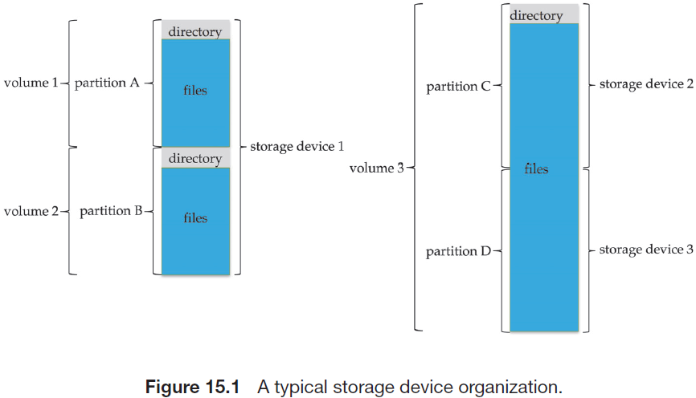
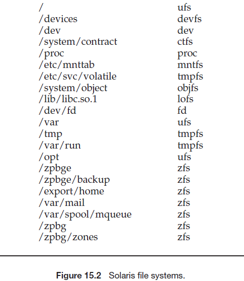
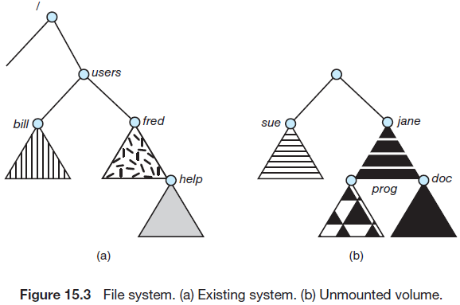
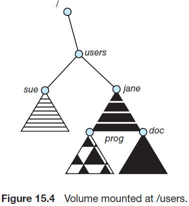
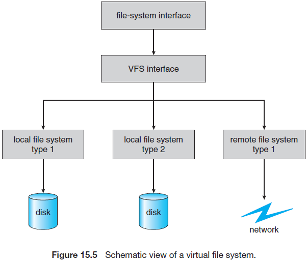

正如在13章中看到的，文件系统提供了在线存储和访问文件内容(包括数据和程序)的机制。本章主要关注文件系统的内存结构和操作。我们会讨论几种使用的文件结构，分配存储，回收空闲空间，跟踪数据位置的方式，以及操作系统与辅助存储的接口。

### 15.1 File Systems

确实，没有任何一个通用计算机会仅仅使用一个文件。通常一个计算机有几千，几百万甚至几十亿个文件。文件存储在随机访问的存储设备上，包括硬盘驱动，光盘和非易失性存储设备。

正如在前面章节中看到的，一个通用计算机系统会有多个存储设备，且这些设备被分割成几个部分，其中包含卷，而卷又包含文件系统。取决于卷管理器，一个卷也可以跨越多个分区。图15.1展示了典型的文件系统组织。

计算机系统也可能包含多个文件系统，且文件系统的类型可能不同。例如，一个典型的Solaris系统可能有数十个文件系统，以及数十个类型，参见图15.2展示的文件系统。

本书中，我们仅会考虑通用的文件系统(虽然还有很多用于特殊场景的文件系统，但没有必要一一讲解)。考虑上面提到的Solaris的文件系统类型：

- tmpfs--一个"临时"文件系统，用于在易失的主存中创建文件，在系统重启或崩溃后会丢失内容。
- objfs--一个虚拟文件系统(本质上是一个内核接口，看起来像一个文件系统)，用于调试访问内核符号。
- ctfs--一个虚拟文件系统，维护“合同”信息以管理系统启动时应该启动哪些进程，且在执行期间必须持续运行。
- lofs--一个回环文件系统，允许一个文件系统代替另一个文件系统来进行访问。
- procfs--一个虚拟文件系统，以文件系统的方式呈现所有进程的信息
- ufs，zfs--通用文件系统。

计算机的文件系统可以被扩展。即使在一个文件系统中，也可以将文件分成多个组，并对这些组进行管理和操作。这种组织会涉及到目录的使用。

### 15.2 File-System Mounting

正如文件系统在使用前必须打开一样，一个文件系统在使用前也必须挂载到系统中。更具体的，目录结构可能由多个包含文件系统的卷组成，这些卷必须挂载后才能在文件系统命名空间中使用。

挂载的流程很直接。给操作系统提供设备名称和挂载点(文件系统可以附加到文件结构中的位置)即可。一些操作系统需要提供一个文件系统类型，而其他会通过检查设备的机构来确定文件系统的类型。通常，一个挂载点是一个空目录。例如，在UNIX系统上，一个包含用户的home目录的文件系统可能被挂载为/home，然后为了访问该文件系统的目录结构，我们可以在目录名称前加上/home，如/home/jane。将该文件系统挂载到/users会使得路径名为/users/jane，通过该路径也会到达相同的目录。

下面，操作系统会校验设备是否包含一个有效的文件系统，请求设备驱动读取设备目录并校验目录是否有期望的格式。最后，操作系统会注意到其目录结构是一个文件系统，且挂载到一个特定的挂载点。这种方案使得操作系统按照预期遍历其目录结构，切换文件系统甚至文件系统的类型。

为了描述文件挂载，考虑图15.3描述的文件系统，其中三角形代表感兴趣的目录的子树。图15.3(a)展示了一个现有的文件系统，图15.3(b)展示了一个位于/device/dsk的未挂载的卷。此时，只能访问存在的文件系统中的文件。图15.4展示了挂载到/users的卷/device/dsk。如果未挂载卷，文件系统会恢复到15.3展示的情况。

系统会强制使用语义来阐明功能。例如，一个系统可能不允许挂载包含文件的目录，否则可能会导致挂载的文件系统可用的同时(在卸载文件系统前)忽略目录中现存的文件，终止文件系统的使用会允许访问该目录中的原始文件。另一个例子，一个系统可能允许重复挂载系统的文件系统到不同的挂载点，会每个文件系统仅允许挂载一次。

考虑macOS操作系统的行为。每当系统第一次遇到磁盘时(无论是启动时间或系统运行时)，macOS操作系统会在设备上查找一个文件系统。如果找到一个，则会自动将文件系统挂载到/Volumes目录下，并添加一个与文件系统人名称相同的文件夹图标。然后用户就可以点击图标来展示新挂载的文件系统。

Microsoft Windows族操作系统会维护一个扩展的两级目录结构，为设备和卷分配驱动器号。每个卷都有一个与设备器号有关的通用图目录结构。特定文件的路径格式为`启动器号:∖path∖to∖file`。最新版本的Windows允许文件系统挂载到目录树的任意位置，与UNIX相同。Windows操作系统会在启动期间自动发现设备并挂载所有的文件系统。一些系统，如UNIX上，挂载命令是显示的。一个系统配置文件包含设备和挂载点的列表，用于在启动时自动挂载，但其他挂载则需要手动执行。

15.3和C.7.5章节会讨论文件系统挂载的问题。

### 15.3 Partitions and Mounting

磁盘的布局可以有很多变化，具体取决于操作系统和卷管理软件。一个磁盘可以分为多个分区，或一个卷可以跨越多个磁盘的多个分区。这里讨论第一个布局，后者更适用于RAID，11.8章节中有所涵盖。

每个分区可以是“raw”，不包含文件系统，也可以是“cooked”，包含文件系统。当没有文件系统时会使用裸磁盘。例如，UNIX交换空间可以使用一个裸分区，它会使用自身的磁盘格式，却不会用到文件系统。同样，一些数据库会使用裸磁盘并将数据格式化为需要的格式。裸磁盘也可以包含磁盘RAID系统需要的信息，如标识哪个块被镜像，以及哪个块已更改且需要镜像的位图。类似地，裸磁盘可以包含RAID配置信息的微型数据库，如哪些磁盘时每个RAID集的成员。11.5.1章节会讨论裸磁盘。

如果一个分区包含可以启动的文件系统，即正确安装和配置的操作系统，那么该分区会需要如11.5.2章节中描述的启动信息。由于启动时系统没有加载的文件系统代码，且无法解析文件系统的格式，因此这种信息有其自身的格式。启动信息通常是作为镜像加载到内存中的顺序的块。镜像从一个预定义的位置启动执行，如第一个字节。这种镜像称为bootstrap加载器，该程序可以识别文件系统的结构，可以查找，加载并执行内核。

引导加载程序可以包含出启动特定操作系统外的指令。例如，很多系统可以双启动，允许在一个系统上安装多个操作系统。系统如何知道应该启动哪个？了解多个文件系统和多个操作系统的引导加载程序会占用引导空间。一旦被加载，它就可以启动设备上的一个可用的操作系统。启动可以有多个分区，每个包含不同类型的文件系统以及不同的操作系统。注意，如果引导加载程序无法理解一个特定的文件系统格式，那么不会启动位于该文件系统上的操作系统。这就是为什么对于任何给定的操作系统，只有一些文件系统可以支持根文件系统的原因之一。

引导加载器选择的根分区包含操作系统内核，有时会包含其他系统文件，在启动时挂载。取决于操作系统，其他卷可以在启动时自动挂载或后续手动挂载。在成功挂载后，操作系统会通过请求设备驱动读取设备命令，并校验目录是否具有期望的格式的方式来校验设备是否包含有效的文件系统。如果格式无效，必须对分区进行一致性校验，有可能会在有或没有人为介入的情况下被修复。最后，操作系统会注意到在内存中的挂载表中，该类型的文件系统已经挂载成功。这些功能取决于操作系统。

Microsoft Windows上，每个卷都会挂载到一个独立的使用字符和冒号表示的命名空间中。例如，为了记录一个挂载到`F:`的文件系统，操作系统会在与`F：`对应的设备结构的字段中放置一个指向文件系统的指针。当一个进程指定驱动字符时，操作系统会查找何时的文件系统指针并遍历该设备上的目录结构来找出指定的文件或目录。后续版本的Windows可以将一个文件系统挂载到现有的任意目录结构。

UNIX上的文件系统可以挂载到任意目录，通过在该目录的inode的内存副本中设置标志来实现挂载，该表示表示该目录是一个挂载点。然后会有一个字段执行挂载表中的一个表项，表示挂载的是哪个设备。挂载表表项包含一个指向该设备上的文件系统的超级块的指针。这种方案使得操作系统能够遍历目录结构，在不同类型的文件系统之间无缝切换。

### 15.4 File Sharing

对于希望进行协作并减少实现计算目标所需的工作量的用户来说，共享文件的能力是非常理想的。因此，面向用户的操作系统尽管存在固有的困难，但必须满足共享文件的需求。

本章中，我们将研究文件共享的更多方面。我们会讨论多用户共享文件下通常会遇到的问题。一旦允许多用户共享文件，会遇到将共享文件扩展到多文件系统，包括远程文件系统的挑战。我们也会讨论这类挑战。最后，我们会考虑如何处理共享文件上发生的冲突操作。例如，如果多用户写入一个文件，是否允许同时写入？或者，操作系统会保护用户彼此之间的操作。

#### 15.4.1 Multiple Users

当一个操作系统可以容纳多个用户时，文件共享，文件命名和文件保护的问题会日益突出。给定一个允许用户共享文件的目录结构时，系统必须调解文件共享。系统要么允许一个用户默认可以访问其他用户的文件，要么需要特定的授权才能访问。这些问题涉及访问控制和防护，见13.4章节。

为了实现共享和防护，相比单用户系统，系统必须维护更多文件和目录属性。虽然很多可以采用多种方式来实现这种需求，但大多数系统演化为使用文件(或目录)，所有者(或用户)和组的概念。所有者就是可以改变文件属性和授权访问的拥有大多数文件控制权限的用户。组属性定义了一个用户子集，可以共享访问该文件。例如，UNIX系统上一个文件的拥有者可以多一个文件执行所有操作，而文件组的成员可以执行这些操作的一部分，而其他用户可以执行这些操作的另一部分。文件的所有者需要明确组成员和其他用户可以执行的操作。

文件(或目录)的所有者和组ID保存在其他文件属性中。当一个用户请求操作一个文件时，可以使用用户ID和文件所有者的属性进行比对，来判断请求的用户是否时文件的所有者。组ID也会使用类似的方式进行比对。比对结果给出了可以执行的权限。然后系统将权限应用于请求操作，允许或拒绝这些请求。

很多系统由多个本地文件系统，包括一个单磁盘卷，或多磁盘上的多个卷。这些场景下，一旦挂载了文件系统，就可以直接使用ID校验和权限匹配。如果系统上的ID不同会发生什么？必须要谨慎处理设备在不同系统间的移动，确保ID能够匹配，或者重置文件的所有权。(例如，我们可以创建一个新用户ID，并将移植的磁盘上的所有文件设置为该ID来保证现有的用户无法意外地访问这些文件。)

### 15.5 Virtual File Systems

正如我们看到的，现代操作必须能够同时支持多类型的文件系统。但一个操作系统如何允许将多类型的文件系统集成到一个目录结构中？用户如何在浏览文件系统空间时在文件系统类型之间无缝移动？我们将讨论这些实现的细节。

一种实现多类型文件系统的次优方法是为每个类型编写目录和文件例程。然而，大多数操作系统，包括UNIX，使用面向对象技术来简化，组织和模块化这种实现。使用这些方法允许不同文件系统使用相同的结构来实现，包括网络文件系统，如NFS。用户可以包含多个文件系统的本地驱动上的文件，甚至跨网络的文件系统。

使用数据结构和程序将基本的系统调用功能与实现细节隔离开。这样，文件系统实现包含三个主要的层，见图15.5。第一层为文件系统接口，基于`open()`, `read()`,`write()`, 和`close()`以及文件描述符。

第二层称为虚拟文件系统层(VFS)。VFS层提供两个主要的功能：

1. 通过定义一个干净的VFS接口将通用的文件系统操作和实现隔离开来。一些VFS接口的实现可能共存于同一台机器上，允许透明访问不同本地挂载的不同类型的文件系统。
2. 提供了一种机制来唯一地表示整个网络中的文件。VFS基于文件表达结构，称为vnode，包含网络范围内的唯一文件的数字标识符。(UNIX inode仅在一个文件系统中是唯一的。)这种网络范围的唯一性用于支持网络文件系统。内核为每个活动的节点(文件或目录)维护一个vnode结构。

VFS通过这种方式来区分本地文件和远端文件，且根据文件所属的文件系统类型来区分本地文件。

VFS根据文件系统类型来激活特定的文件系统操作(本地)请求，以及为远端请求调用NFS协议程序(或其他用于网络文件系统的协议程序)。通过相关的vnode构造文件句柄，并作为参数传递给这些处理程序。实现了文件系统类型或远端文件系统协议的层，即架构中的第三层。

简单看一下Linux中的VFS架构。Linux VFS定义的四个主要对象的类型为：

- inode对象，表示一个单独的文件
- 文件对象，表示一个打开的文件
- 超级块对象，表示整个文件系统
- 目录对象，表示单独的目录表项

对于这四种中的每一种类型，VFS定义了可能实现的操作集。这些类型的每个对象都包含一个指向函数表的指针。函数表列出了为特定对象实现的操作的实际函数的地址。例如，文件对象的一些操作的API缩写包括：

- int open(. . .)—打开一个文件
- int close(. . .)—关闭一个已经打开的文件
- ssize t read(. . .)—读取一个文件
- ssize t write(. . .)—写入一个文件
- int mmap(. . .)—内存映射一个文件

要实现文件对象定义中指定的每个功能，需要实现特定文件类型的文件对象。(完整的文件对象定义在文件结构file_operations中，位于文件/usr/include/linux/fs.h。)

这样，VFS软件层可以通过从对象的函数表中调用合适的函数来对某个对象执行某个操作，而无需提前知道需要处理的对象的类型。VFS不知道也不关注一个inode表示的是一个磁盘文件，目录文件还是远端文件。文件的`read()`操作总会位于函数表的相同位置，VFS软件层只要调用该函数即可，无需关注实际数据是如何被读取的。

### 15.6 Remote File Systems

随着网络的出现(19章)，与远端计算机的通信称为可能。网络允许跨校园甚至在世界范围内共享资源。一种明显的资源是共享文件中的数据。

在网络和文件技术的演进过程中，远端文件的共享方法也发生了变化。第一个实现的方法涉及通过ftp等程序在机器之间手动传输文件。第一个主要的方式为使用分布式文件系统(DFS)，即本地机器可以看到远端目录。还有一些方式，如万维网，是第一种方式的反面，需要使用浏览器来访问远端文件，并使用独立的操作(基本上是ftp的封装)来传输文件。目前越来越多地使用云计算来共享文件。

ftp可以用于匿名或认证访问。匿名访问允许在没有远端系统账户地前提下传输文件。万维网几乎只使用匿名文件交换。DFS涉及的正在访问远程文件的计算机与提供文件的计算机之间的集成度更高，这种集成增加了复杂度，本章节会进行介绍。

#### 15.6.1 The Client–Server Model

远端文件系统允许一个计算机从一个或多个远端机器上挂载一个或多个文件系统。这种情况下，包含文件的机器为server，查找访问文件的机器为client。client-server一般指网络机器之间的关系。server通常会声明client可以操作的资源，并指定哪些资源和哪些client。一个server可以为多个client提供服务，且一个client可以使用多个server，具体取决于给定的client-server的实现细节。

server通常会指定一个卷或目录级上的可用的文件。client的识别则更加困难，一个client可以通过网络名称或其他标识符指定，如IP地址，但这些是可以被欺骗或模仿的。欺骗的结果是，一个未授权的client可以访问server。有多种安全解决方案来防止发生这种情况，如client通过加密密钥来对client进行安全身份认证。不幸的是，由于安全面临很多挑战，包括确保客户机和服务器的兼容性(必须使用系统的加密算法)以及密钥交互的安全性(被拦截的密钥可以抵御未授权访问)。由于解决这些问题的难度，最常使用的是非安全授权方式。

在一些UNIX和其网络文件系统(NFS)场景下，默认会通过client的网络信息进行认证。使用这种方案时，client的用户ID和server的用户ID必须匹配。如果不匹配，server将无法确定文件的访问权限。例如client端的一个用户ID为1000，server为2000，此时server端将无法正确处理从client到server的对特定文件的请求(server将会确认用户1000是否可以访问文件，而不是基于真实的用户ID 2000)。这样，会基于不正确的认证信息来进行授权或拒绝，服务器必须信任客户端以提供正确的用户ID。注意NFS协议允许多对多关系，即多个server可以给多个client通过文件服务。事实上，一个给定的机器可以既是提供NFS client服务的server，也可以是其他NFS server的client。

一旦挂载了远端文件系统。client发送的操作请求会通过DFS协议从网络上传达给server。通常，一个文件打开请求会伴随请求用户的ID一起发送，然后server会使用标准访问校验来判断该用户是否可以使用请求中的证书来访问文件，最后允许或拒绝该请求。如果允许，会将文件句柄返回给client应用，然后该应用就可以执行读，写以及其他文件操作。在访问结束后，client会关闭该文件。操作系统可能会使用相同或不同的语义来处理关在的本地文件系统。

#### 15.6.2 Distributed Information Systems

为了更简单地管理client-server系统，使用分布式信息系统，也被称为分布式命名服务来为远端计算提供所需信息的统一访问。域名系统(DNS)提供了整个因特网的主机名到网络地址的转换。在DNS普及之前，包含相同信息的文件会通过电子邮件或ftp在所有网络主机间发送。显然， 这种方法是不可扩展的。19.3.1或讨论DNS。

其他分布式信息系统为分布式设施提供了用户名/密码/用户ID/组ID空间。UNIX系统引入了大量分布式信息方法。Sun Microsystems(目前是Oracle Corporation的一部分)引入黄页(重命名为网络信息服务，或NIS)，大多数工业采用了这种方式。它集中存储用户名，主机名，打印信息等等。不幸的是，它使用非安全认证方式，包含发送非加密的用户信息(明文)以及使用IP地址鉴别主机。Sun的NIS+是一种更安全的NIS的替代方案，但更复杂且没有被广泛采纳。

微软的通用因特网文件系统(CIFS)下，会将网络信息于用户认证结合起来创建一个网络登陆，server会使用这些信息来判断是否允许或绝访问请求的文件系统。为了能通过认证，用户名必须在机器之间匹配。微软使用活动目录作为一个分布式命名结构来为用户提供单独的命名空间。一旦建立，所有client和server会使用分布式命名设施并通过微软的Kerberos网络认证协议(https://web.mit.edu/kerberos/).来对用户进行认证。

工业已经转向轻量目录访问协议(LDAP)作为安全的分布式命名机制。实际上，活动目录也基于LDAP。Oracle Solaris和大多数主要的操作系统都包含了LDAP，并允许使用该机制进行用户认证，以及系统范围内的信息检索，如可用的打印机。可以想象，一个组织可以使用一个分布式LDAP目录来为所有的组织计算机保存所有的用户和资源信息。最终为用户提供安全的单点登录，通过输入一次身份验证信息来访问组织内的所有计算机。通过在一个位置组合当前散布在每个系统上的各种文件或不同的分布式信息服务中的信息，也可以简化系统管理工作。

#### 15.6.3 Failure Modes

本地文件系统可能由于多种原因失败，包括含文件系统的驱动的失败，目录结构或其他磁盘管理信息(总的来说称为元数据)的失败，磁盘控制器的失败，线路失败和主机适配器的失败。用户或系统管理员的失败也会导致文件的丢失或整个目录或卷的删除。很多这类失败将会导致主机崩溃以及显示错误信息，有可能需要人为介入来进行修复。

远端文件系统的失败模式更多，由于网络系统和远程机器间交互的复杂度，在正常操作远端文件系统时也会产生很多问题。在网络环境下，两端主机都可以中断网络连接。硬盘失败，硬件配置不良或网络实现问题都可能导致这种中断。虽然一些网络内置了弹性，包括多主机间采用多路径，但许多网络并没有这种弹性能力。任何一个单一失败都可能中断DFS命令的流程。

考虑一个正在使用远端文件系统的客户端，它打开了远端主机上的文件，同时还进行了其他操作，如执行目录查找来打开文件，读取或写入文件，关闭文件等。现在考虑网络的划分，由于服务端的崩溃或计划性地关闭服务器导致远端文件系统突然无法访问。这种情况非常普遍，当一个本地文件系统丢失后，客户端不应该继续对其进行操作，而应该中断丢失的服务器对应的文件系统上的操作，或延迟这类操作，直到可以访问服务器。远端文件系统协议定义了这类失败语义。中断所有的操作将导致用户丢失数据和耐心。因此，大多数DFS协议要么强制要么允许延迟到远端主机的文件系统操作，用以等到远端主机服务再次上线。

为了实现这种失败恢复，需要使用一些状态信息来维护客户端和服务端。如果服务端和客户端维护了各自的当前状态和打开的文件，那么就可以无缝地进行失败恢复。在服务端崩溃的情况下必须识别其远端挂载的文件系统和打开的文件系统，版本3的NFS使用了一种简单的方式实现了无状态的DFS。本质上，除非挂载了远端文件系统，且文件已经被打开，否则它会假设客户端没有发送对文件的读或写请求。NFS协议携带了所需要的所有信息来定位合适的文件并执行请求的操作。类似地，它不会跟踪哪个客户端挂载了卷，当接收到一个请求时，必须保证该请求是合法的。这种无状态的方式使NFS具有弹性，也更加容易实现，但也使它不安全。例如，NFS服务端会允许一个伪造的读或写请求。这种问题在行业标准NFS版本4中进行了修复，通过使NFS具有状态来提高其安全性，性能和功能。

### 15.7 Consistency Semantics